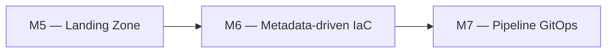

# Module 6 : Cours : Logique Dynamique

> [<- Jour 2](../README.md) · [<- Module precedent](../module-05-modules/lab.md) · **Module 06** · [Module suivant ->](../module-07-cicd-pipeline/lab.md)

## Contexte métier

La plateforme doit absorber de nouveaux schémas, warehouses et domaines sans dupliquer le code. Les collections typées rendent le déploiement piloté par métadonnées.

## Contexte architecture



| Référentiel | Alignement |
|---|---|
| Pattern | Data-Driven IaC |
| Azure Well-Architected | Efficacité des performances, Excellence opérationnelle |
| Azure CAF | Adopt |
| Platform Engineering | Self-service piloté par données |

## Pattern d'entreprise

Le pattern **Data-Driven IaC** sépare la définition métier des ressources de leur moteur de création et garantit des adresses stables avec `for_each`.

---

## 1. for_each sur schemas

```hcl
variable "schemas" {
  type    = set(string)
  default = ["SALES", "FINANCE", "HR"]
}

resource "snowflake_schema" "raw" {
  for_each = var.schemas
  database = snowflake_database.raw.name
  name     = each.key
  comment  = "Schema ${each.key} - ${var.environment}"
}
```

Référence : `snowflake_schema.raw["SALES"].name`

## 2. count ? pièges

```hcl
# Éviter si possible ? suppression (recrée tout) tout
resource "snowflake_role" "example" {
  count = length(var.roles)
  name  = var.roles[count.index]
}
```

## 3. dynamic blocks

Pour attributs répétitifs optionnels (tags, policies) :

```hcl
dynamic "parameters" {
  for_each = var.warehouse_parameters
  content {
    name  = parameters.key
    value = parameters.value
  }
}
```

## 4. Diagramme décision

```mermaid
flowchart TD
    Q{Ressources identiques<br/>clé stable ?}
    Q -->|Oui| FE[for_each map/set]
    Q -->|Non, ordre seul| C[count (rare)]
    Q -->|Blocs nested optionnels| D[dynamic block]
```

---

## 5. Design Patterns & Best Practices

| Pattern | Application |
|---------|-------------|
| **for_each > count** | `for_each` = identité stable par clé. `count` fragilise l'ordre. |
| **toset() pour list(string)** | `for_each` exige des clés uniques. `toset()` garantit l'unicité. |
| **for Expressions** | Transformations puissantes dans outputs : `[for s in ... : s.name]`. |
| **try() / lookup()** | Gérer les valeurs optionnelles : `auto_suspend = try(each.value.auto_suspend, 60)`. |
| **dynamic Blocks** | Pour les attributs répétés optionnels. Évite la duplication de code. |

### Lab associé

Voir [lab.md](./lab.md) pour la mise en pratique complète.

---

## Navigation

[<- Course M5](../module-05-modules/course.md) · [<- Jour 2](../README.md) · **Course M6** · [Course M7 ->](../module-07-cicd-pipeline/course.md)


