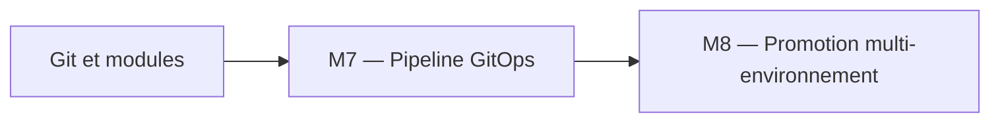
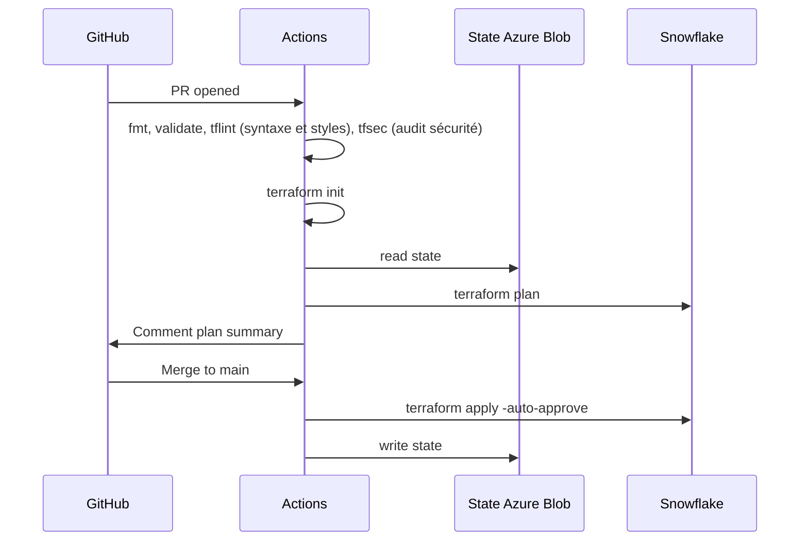

# Module 7 – Cours : Pipeline CI/CD

> [<- Jour 2](../README.md) · [<- Module precedent](../module-06-dynamic-logic/lab.md) · **Module 07** · [Module suivant ->](../module-08-environments/lab.md)

## Contexte métier

Les changements manuels ne fournissent ni séparation des responsabilités ni preuve d'approbation. Le pipeline produit un plan immuable, applique après revue et audite la dérive.

## Contexte architecture



| Référentiel | Alignement |
|---|---|
| Pattern | GitOps Promotion Pipeline |
| Azure Well-Architected | Sécurité, Excellence opérationnelle |
| Azure CAF | Govern |
| Platform Engineering | Plan sur PR, apply approuvé, audit continu |

## Pattern d'entreprise

Le pattern **GitOps Promotion Pipeline** sépare validation, plan et apply, conserve l'artefact approuvé et interdit la reconstruction d'un plan différent au moment du déploiement.

---

## 1. Pipeline type



## 2. Plan sur PR, Apply sur main

**Principe** : jamais d'apply automatique sur une branche feature sans review.

## 3. tfsec (audit sécurité) exemple

```bash
tfsec (audit sécurité) project/ --minimum-severity MEDIUM
```

Les alertes de sécurité courantes comprennent les comptes de stockage publics ou le chiffrement désactivé.


## 4. tflint (syntaxe et styles)

```hcl
# .tflint (syntaxe et styles).hcl
plugin "terraform" {
  enabled = true
  preset  = "recommended"
}
```

## 5. Artefacts

Conserver `plan.tfplan` et logs en artifact CI pour audit.

## 6. Azure DevOps Pipelines (implémentation actuelle)

Le pipeline `azure-pipelines.yml` implémente le même comportement (validate, plan, apply, audit) avec des **stages** et des **conditions** :

- **Validate** : `terraform fmt -check`, `tflint`, `tfsec`, puis `init -backend=false` + `validate` **uniquement sur le capstone** `project/05-capstone/environments/dev`.
- **Plan** : s'exécute après `Validate` (PR et `main`) et publie l'artefact `tfplan` + `tfplan.txt`.
- **Apply** : s'exécute uniquement sur `main`, **dépend de `Plan`**, et applique l'artefact du run courant. Utilise un **Environment Azure DevOps** pour l'approbation manuelle.
- **Audit** : `terraform plan -detailed-exitcode` pour vérifier l'absence de drift. Le stage FinOps/dbt a été retiré car il requiert un agent auto-hébergé capable d'exécuter Python.

### Authentification WIF

Le pipeline s'authentifie auprès d'Azure via **Workload Identity Federation** (WIF). Un `AzureCLI@2` récupère un token OIDC et exporte `ARM_CLIENT_ID`, `ARM_TENANT_ID`, `ARM_SUBSCRIPTION_ID` et `ARM_OIDC_TOKEN`.

### Agent pool

Le pipeline cible le pool `azure-vm-agents`, un agent Linux auto-hébergé provisionné par `project/07-devops-agents` via cloud-init.

### Correspondance des concepts CI/CD :

| Concept | Azure DevOps Pipelines |
|---------|------------------------|
| Workflow / Pipeline | `azure-pipelines.yml` |
| Unité d'exécution | Job (`pool: azure-vm-agents`) |
| Regroupement logique | Stages (`dependsOn`) |
| Secrets de pipeline | Azure Key Vault + WIF (`terraform-arm`) |
| Artefacts | `PublishPipelineArtifact` / `DownloadPipelineArtifact` |
| Approbation manuelle | Azure Pipelines Environments |

---

## 7. Pipeline as Code avec le provider Azure DevOps

Le provider Terraform `microsoft/azuredevops` permet de gérer les pipelines Azure DevOps **comme du code** (IaC pour CI/CD). Cela inclut la création de projets, repositories, pipelines, variable groups et environnements.

```hcl
terraform {
  required_providers {
    azuredevops = {
      source  = "microsoft/azuredevops"
      version = "1.14.0"
    }
  }
}

provider "azuredevops" {
  org_service_url       = "https://dev.azure.com/myorg"
  personal_access_token = var.ado_pat
}
```

Exemple — créer un pipeline Terraform :

```hcl
resource "azuredevops_project" "terraform" {
  name               = "Terraform-Snowflake"
  version_control    = "Git"
  visibility         = "private"
  work_item_template = "Agile"
}

resource "azuredevops_repository" "repo" {
  project_id = azuredevops_project.terraform.id
  name       = "terraform-snowflake"
  initialization {
    init_type = "Clean"
  }
}

resource "azuredevops_variable_group" "secrets" {
  project_id   = azuredevops_project.terraform.id
  name         = "terraform-secrets"
  description  = "Secrets for Terraform pipeline"
  allow_access = true

  variable {
    name      = "SNOWFLAKE_ACCOUNT"
    value     = var.snowflake_account
    is_secret = true
  }

  variable {
    name      = "ARM_CLIENT_ID"
    value     = var.arm_client_id
    is_secret = true
  }
}

resource "azuredevops_build_definition" "terraform" {
  project_id = azuredevops_project.terraform.id
  name       = "Terraform CI/CD"
  path       = "\\Terraform"

  repository {
    repo_type   = "TfsGit"
    repo_id     = azuredevops_repository.repo.id
    branch_name = "main"
    yml_path    = "azure-pipelines.yml"
  }
}
```

> **Best Practice :** Gérer les pipelines via Terraform garantit que l'infrastructure CI/CD est versionnée, auditable et reproductible. Les secrets sont injectés via des Variable Groups marqués `is_secret = true`.

---

## 8. Design Patterns & Best Practices

| Pattern | Application | Pilier Well-Architected |
|---------|-------------|-------------------------|
| **Plan-on-PR** | `terraform plan` sur chaque PR. L'équipe review le plan avant merge. | Excellence Opérationnelle |
| **Apply-on-Main** | L'apply est déclenché automatiquement sur `main` après merge. | Excellence Opérationnelle |
| **Validate First** | `terraform fmt → init -backend=false → validate` pour valider la syntaxe tôt. | Excellence Opérationnelle |
| **Static Analysis & Security Scanning** | Utilisation de `tflint (syntaxe et styles)` et `tfsec (audit sécurité)`/`trivy` pour détecter les failles avant le plan. | Sécurité / Excellence Opérationnelle |
| **Séparation des Stages** | Stages distincts : validation rapide, plan avec backend, apply avec approbation d'environnement. | Fiabilité |
| **Secrets in CI** | Clé privée et clés d'accès injectées via secrets de pipeline encodés en base64. Jamais dans le code. | Sécurité |
| **Plan Artifacts** | Sauvegarde du plan binaire pour audit ou ré-apply contrôlé (évite les décalages de configuration). | Fiabilité |
| **Pipeline as Code** | Provider `azuredevops` pour gérer projets, repos, pipelines et variable groups via Terraform. | Excellence Opérationnelle |


### Lab associé

Voir [lab.md](./lab.md) pour la mise en pratique complète.

---

## Navigation

[<- Course M6](../module-06-dynamic-logic/course.md) · [<- Jour 2](../README.md) · **Course M7** · [Course M8 ->](../module-08-environments/course.md)


