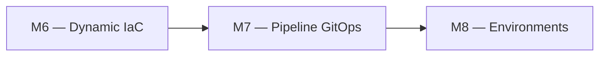
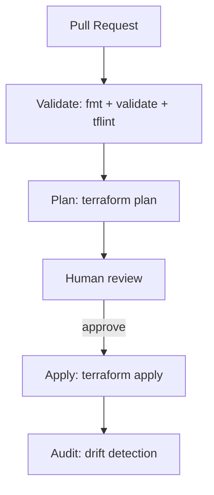

# 🧪 Lab M7 — Pipeline CI/CD Terraform avec Azure DevOps

> [<- Jour 2](../README.md) · [<- Module precedent](../module-06-dynamic-logic/lab.md) · **Module 07** · [Module suivant ->](../module-08-environments/lab.md)

| Élément | Valeur |
|---|---|
| **Durée** | 75 min |
| **Piste** | `[CORE]` |
| **Workspace** | `$HOME/Data2AI-Labs/data-platform` (le clone) |
| **Dossier de travail** | `labs/m07-cicd-pipeline/` |
| **Coût** | Aucun (pipeline gratuit avec agent Microsoft) |
| **Cleanup** | Aucune ressource à détruire |

> `[IMPORTANT]` Avant de commencer, vous devez etre dans la racine du clone
> et avoir execute `Learner-Login.ps1` dans **cette session** :
>
> ```powershell
> cd "$HOME\Data2AI-Labs\data-platform"
> .\scripts\Learner-Login.ps1 -LearnerPrefix APP01
> ```
>
> Cela set `TF_VAR_snowflake_token` (depuis `secrets/snowflake_pat.txt`)
> et les variables `ARM_*` pour Terraform.
>
> Réinitialisez le lab pour nettoyer d'éventuels restes d'un précédent passage :
>
> ```powershell
> .\scripts\Reset-Lab.ps1 -LearnerPrefix APP01 -Lab M07
> ```
>
> Puis placez-vous dans le dossier du lab :
>
> ```powershell
> cd labs\m07-cicd-pipeline
> ```

## 🎯 1. Mission Métier & User Story

Les changements manuels ne fournissent ni séparation des responsabilités ni preuve d'approbation. Vous allez configurer un pipeline Azure DevOps qui produit un plan immuable, applique après revue et audite la dérive.

> **En tant que :** Data Platform Engineer  
> **Je veux :** configurer un pipeline CI/CD Azure DevOps pour Terraform  
> **Afin de :** garantir la séparation des responsabilités et l'approbation avant déploiement

---

## 🏗️ 2. Architecture & Modèle Mental





## 🎯 3. Objectifs Pédagogiques Vérifiables

- créer et comprendre le pipeline `azure-pipelines.yml`;
- configurer un service connection Azure DevOps;
- exécuter un plan sur une PR;
- appliquer après approbation;
- comprendre les gates d'environnement.

## � 4. Pre-Flight Diagnostic (Vérification Initiale)

### Prérequis

- [ ] Jour 0 terminé : `Toolchain status: READY`;
- [ ] un projet Azure DevOps avec accès au repository;
- [ ] un service connection Azure DevOps pour Snowflake (ou PAT en variable group).

## 📝 5. Étapes d'Implémentation Pas-à-Pas (80% Hands-On)

### 📝 Étape 5.1 — Créer le pipeline

#### Créer `azure-pipelines.yml`

Ce lab ne crée **aucune ressource Snowflake**. Il s'agit uniquement de configurer
le pipeline CI/CD qui orchestrera vos déploiements Terraform.

Créez le fichier `azure-pipelines.yml` dans `labs/m07-cicd-pipeline/` :

```yaml
# Azure DevOps pipeline for Terraform CI/CD
# This pipeline validates, plans, applies and audits Terraform changes.
#
# In a real project, this file would live at the repository root.
# For this lab, we create it in labs/m07-cicd-pipeline/ to keep it self-contained.

trigger:
  branches:
    include:
      - main

pr:
  branches:
    include:
      - main

pool:
  vmImage: 'ubuntu-latest'

variables:
  - group: data-platform-secrets
  - name: TF_VERSION
    value: '1.14.5'

stages:
  - stage: Validate
    jobs:
      - job: Validate
        steps:
          - task: TerraformInstaller@1
            displayName: 'Install Terraform'
            inputs:
              terraformVersion: '$(TF_VERSION)'

          - script: |
              cd labs/m06-dynamic-logic
              terraform fmt -check -recursive
            displayName: 'terraform fmt -check'

          - script: |
              cd labs/m06-dynamic-logic
              terraform init -backend=false
              terraform validate
            displayName: 'terraform validate'

          - script: |
              sudo apt-get update && sudo apt-get install -y tflint
              cd labs/m06-dynamic-logic
              tflint --recursive
            displayName: 'tflint'
            continueOnError: true

  - stage: Plan
    dependsOn: Validate
    jobs:
      - job: Plan
        steps:
          - task: TerraformInstaller@1
            displayName: 'Install Terraform'
            inputs:
              terraformVersion: '$(TF_VERSION)'

          - script: |
              cd labs/m06-dynamic-logic
              terraform init
              terraform plan -out=tfplan -input=false
            displayName: 'Terraform Plan'
            env:
              TF_VAR_snowflake_token: $(SNOWFLAKE_PAT)
              ARM_SUBSCRIPTION_ID: $(ARM_SUBSCRIPTION_ID)
              ARM_TENANT_ID: $(ARM_TENANT_ID)

          - task: PublishPipelineArtifact@1
            displayName: 'Publish tfplan'
            inputs:
              targetPath: 'labs/m06-dynamic-logic/tfplan'
              artifact: tfplan

  - stage: Approval
    dependsOn: Plan
    condition: and(succeeded(), eq(variables['Build.SourceBranch'], 'refs/heads/main'))
    jobs:
      - deployment: Approval
        environment: Approval
        strategy:
          runOnce:
            deploy:
              steps:
                - script: echo "Waiting for manual approval"
                  displayName: 'Manual approval gate'

  - stage: Apply
    dependsOn: Approval
    condition: and(succeeded(), eq(variables['Build.SourceBranch'], 'refs/heads/main'))
    jobs:
      - job: Apply
        steps:
          - task: TerraformInstaller@1
            displayName: 'Install Terraform'
            inputs:
              terraformVersion: '$(TF_VERSION)'

          - task: DownloadPipelineArtifact@2
            displayName: 'Download tfplan'
            inputs:
              artifact: tfplan
              targetPath: 'labs/m06-dynamic-logic/'

          - script: |
              cd labs/m06-dynamic-logic
              terraform init
              terraform apply tfplan -input=false
            displayName: 'Terraform Apply'
            env:
              TF_VAR_snowflake_token: $(SNOWFLAKE_PAT)
              ARM_SUBSCRIPTION_ID: $(ARM_SUBSCRIPTION_ID)
              ARM_TENANT_ID: $(ARM_TENANT_ID)

  - stage: Audit
    dependsOn: Apply
    condition: and(succeeded(), eq(variables['Build.SourceBranch'], 'refs/heads/main'))
    jobs:
      - job: Audit
        steps:
          - task: TerraformInstaller@1
            displayName: 'Install Terraform'
            inputs:
              terraformVersion: '$(TF_VERSION)'

          - script: |
              cd labs/m06-dynamic-logic
              terraform init
              terraform plan -detailed-exitcode -input=false
            displayName: 'Drift detection (terraform plan -detailed-exitcode)'
            env:
              TF_VAR_snowflake_token: $(SNOWFLAKE_PAT)
              ARM_SUBSCRIPTION_ID: $(ARM_SUBSCRIPTION_ID)
              ARM_TENANT_ID: $(ARM_TENANT_ID)
```

#### Comprendre les stages

Le pipeline contient 5 stages :

| Stage | Trigger | Rôle |
|---|---|---|
| `Validate` | PR et main | `terraform fmt -check`, `validate`, `tflint` |
| `Plan` | PR et main | `terraform plan -out=tfplan` |
| `Approval` | main only | Gate manuel avant apply |
| `Apply` | main only | `terraform apply tfplan` |
| `Audit` | main only | `terraform plan -detailed-exitcode` pour détecter la dérive |

#### Comprendre les variables

Le pipeline utilise des variables stockées dans un Variable Group Azure DevOps :

| Variable | Description |
|---|---|
| `ARM_SUBSCRIPTION_ID` | ID de souscription Azure |
| `ARM_TENANT_ID` | ID de tenant Azure |
| `SNOWFLAKE_CONNECTION` | Nom de connexion Snowflake CLI |
| `SNOWFLAKE_PAT` | PAT (secret, masqué) |

> 🔒 **SECURITY** : Les secrets sont stockés dans le Variable Group et jamais dans le code.

### 📝 Étape 5.2 — Configurer Azure DevOps

#### Créer un Variable Group

1. Dans Azure DevOps, allez dans **Pipelines > Library**;
2. cliquez **+ Variable group**;
3. nommez-le `data-platform-secrets`;
4. ajoutez les variables ci-dessus;
5. marquez `SNOWFLAKE_PAT` comme secret;
6. liez le variable group au pipeline.

#### Connecter le repository

1. Dans **Pipelines > Pipelines**, cliquez **New Pipeline**;
2. sélectionnez votre repository Git;
3. choisissez **Existing Azure Pipelines YAML file**;
4. sélectionnez `/labs/m07-cicd-pipeline/azure-pipelines.yml`;
5. exécutez le pipeline.

### 📝 Étape 5.3 — Tester le pipeline sur une PR

#### Créer une branche

```bash
cd "$HOME/Data2AI-Labs/data-platform"
git checkout -b feature/add-archive-schema
```

#### Faire un changement mineur

Dans `labs/m06-dynamic-logic/main.tf`, ajoutez un schema supplémentaire dans le bloc `schemas` :

```hcl
  schemas = {
    ingestion = { name = "INGESTION", comment = "Ingestion schema" }
    staging   = { name = "STAGING",   comment = "Staging schema" }
    archive   = { name = "ARCHIVE",   comment = "Archive schema" }
  }
```

#### Commit et push

```bash
git add labs/m06-dynamic-logic/main.tf
git commit -m "Add ARCHIVE schema to landing zone"
git push origin feature/add-archive-schema
```

#### Créer une PR

Dans Azure DevOps, créez une Pull Request vers `main`.

#### Observer le pipeline

#### Créer et Réviser la Pull Request dans Azure DevOps Web

1. Ouvrez votre navigateur sur **[dev.azure.com](https://dev.azure.com)** et accédez à votre projet.
2. Dans le menu de gauche, rendez-vous dans **Repos > Pull requests** et cliquez sur **New pull request**.
3. Sélectionnez votre branche source `feature/add-archive-schema` vers `main`.
4. Donnez le titre : `feat: add archive schema to landing zone` et cliquez sur **Create**.
5. Observez le déclenchement automatique de la validation :
   - Le pipeline s'active dans la section **Checks / Builds**.
   - Cliquez sur le build en cours pour observer en direct l'exécution de `Validate` (`terraform fmt -check`, `validate`, `tflint`) puis de `Plan`.
6. Cliquez sur le stage **Plan** dans les logs :
   - Vérifiez le rapport différentiel : `Plan: 1 to add, 0 to change, 0 to destroy` (le schema `ARCHIVE`).

---

#### Approuver l'Environment Gate & Observer l'Apply

1. Retournez dans la Pull Request et cliquez sur **Approve**, puis **Complete** (sélectionnez *Merge (no fast-forward)*) et validez.
2. Rendez-vous dans **Pipelines > Pipelines** et cliquez sur la dernière exécution déclenchée sur la branche `main`.
3. Le pipeline exécute `Validate` puis `Plan`.
4. **Action Manuelle d'Approbation (Manual Approval Gate) :**
   - Le stage `Apply` passe au statut *Waiting for approval*.
   - En tant qu'ingénieur responsable de la plateforme, cliquez sur **Review** > **Approve**.
5. Observez le job `Apply` exécuter `terraform apply tfplan` avec succès.
6. Le dernier stage `Audit` s'exécute automatiquement : il lance un `terraform plan` de contrôle et affiche `No changes. Your infrastructure matches the configuration.` (zéro dérive).

---

#### Vérification dans Snowflake Snowsight

1. Ouvrez votre console **Snowflake Snowsight (`https://app.snowflake.com`)**.
2. Naviguez dans **Data > Databases** > Votre base de données.
3. Constatez la présence du nouveau schema `ARCHIVE` créé automatiquement par la chaîne CI/CD sans aucune intervention manuelle directe sur Snowflake.

---

### � Étape 5.4 — Comprendre les gates d'environnement

#### Gates par environnement

Le pipeline peut être étendu pour gérer DEV, UAT et PROD avec des gates :

| Environnement | Gate | Qui approuve |
|---|---|---|
| DEV | Automatique | — |
| UAT | Approval manuel | Tech lead |
| PROD | Approval manuel + fenêtre | Change advisory board |

#### Ajouter un stage UAT (concept)

```yaml
- stage: PlanUAT
  dependsOn: ApplyDev
  jobs:
  - job: PlanUAT
    steps:
    - script: |
        cd labs/m08-environments/uat
        terraform init
        terraform plan -out=tfplan
      displayName: 'Terraform Plan UAT'

- stage: ApplyUAT
  dependsOn: PlanUAT
  condition: and(succeeded(), eq(variables['Build.SourceBranch'], 'refs/heads/main'))
  jobs:
  - deployment: ApplyUAT
    environment: UAT
    strategy:
      runOnce:
        deploy:
          steps:
          - script: |
              cd labs/m08-environments/uat
              terraform apply tfplan
```

---

## 🐛 6. Incident Contrôlé (*Chaos Engineering Lab*)

*Pour éprouver la robustesse de votre garde-fou automatisé :*

### Symptôme & Injection

Créez une nouvelle branche locale `feature/broken-syntax` :

```powershell
git checkout -b feature/broken-syntax
```

Dans un fichier `.tf`, introduisez délibérément une erreur de syntaxe (ex: une accolade non fermée ou un type de variable erroné).

Commitez et poussez la branche vers Azure Repos :

```powershell
git commit -am "test: introduce syntax error"
git push origin feature/broken-syntax
```

### Diagnostic & Observation

Ouvrez la Pull Request sur **Azure DevOps Web** :

- Constatez que le stage `Validate` passe instantanément en **rouge (Failed)**.
- La Pull Request est **bloquée**, empêchant tout déploiement corrompu en production.

### Remédiation

Corrigez l'erreur en local, commitez et poussez. Le pipeline se relance automatiquement et repasse au **vert**.

---

## 🤖 7. Validation Automatisée (*Check My Progress*)

Exécutez le script d'auto-évaluation pour vérifier la conformité de votre pipeline et de vos configurations :

```powershell
.\scripts\SelfPacedLab.ps1 -Module 7 -All -Report
```

✅ **Résultat attendu :**
```text
[PASS] T1 azure-pipelines.yml exists
[PASS] T1 Multi-stage pipeline declared (Validate, Plan, Apply)
[PASS] T2 Approval gate environment configured
[PASS] T3 terraform fmt & validate passed
[PASS] T4 Git branch hygiene compliant
Result: 5/5 Tasks Passed.
```

---

## 🏆 8. Défi Autonome (*Unguided Challenge*)

> **Scénario :** Ajoutez un stage `tflint` au pipeline qui échoue si `tflint` détecte des problèmes dans `labs/m06-dynamic-logic/modules/`.
> **Contraintes :**
> - le stage `Validate` exécute `tflint`;
> - le pipeline échoue si `tflint` retourne des erreurs;
> - le pipeline passe après correction.

| Critère d'Évaluation | Points |
|---|---:|
| Syntaxe HCL et respect des standards | 30 pts |
| Preuve d'exécution fonctionnelle | 30 pts |
| Idempotence (`0 to add, 0 to change, 0 to destroy`) | 20 pts |
| Respect des budgets FinOps & Sécurité | 20 pts |
| **Total** | **100 pts** |

## 🧹 9. Nettoyage Contrôlé (*FinOps Teardown*)

Ce lab ne crée **aucune ressource Snowflake**. Il n'y a pas de `terraform destroy` à exécuter.

> 💡 **Note** : Si vous avez appliqué des changements via le pipeline (Étape 5.3),
> nettoyez les ressources du lab M06 avec `.\scripts\Reset-Lab.ps1 -LearnerPrefix APP01 -Lab M06`.

---

## Navigation

[<- Lab M6](../module-06-dynamic-logic/lab.md) · [<- Jour 2](../README.md) · **Lab M7** · [Lab M8 ->](../module-08-environments/lab.md)
