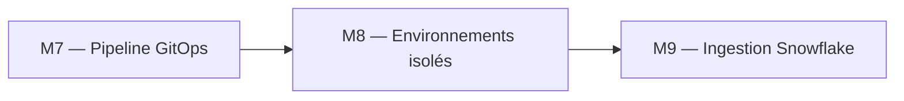
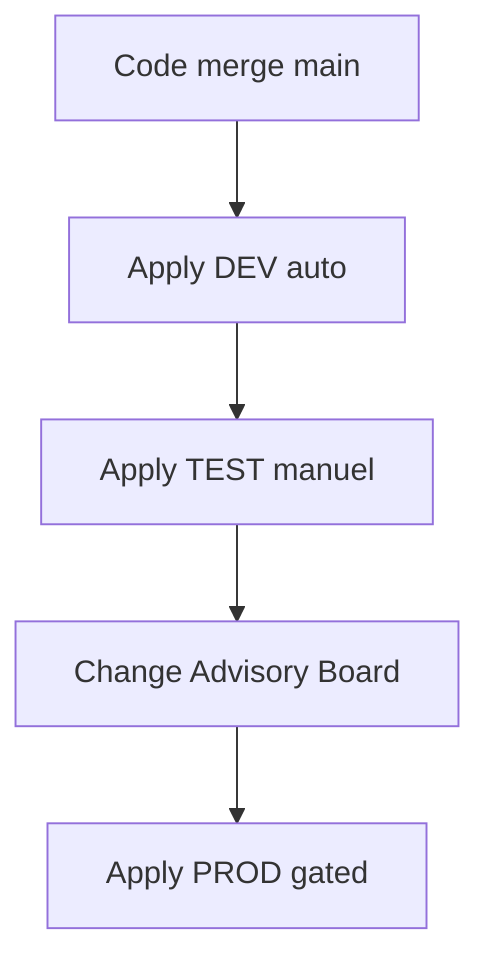

# Module 8 : Cours : Gestion des environnements

> [<- Jour 2](../README.md) · [<- Module precedent](../module-07-cicd-pipeline/lab.md) · **Module 08** · [Jour 3 ->](../../day-03/README.md)

## Contexte métier

DEV, TEST et PROD ont des risques, coûts et rythmes différents. Leur isolation de state et de nommage évite les collisions tout en conservant un code commun.

## Contexte architecture



| Référentiel | Alignement |
|---|---|
| Pattern | Environment Isolation |
| Azure Well-Architected | Fiabilité, Optimisation des coûts |
| Azure CAF | Govern |
| Platform Engineering | Promotion contrôlée d'un même produit |

## Pattern d'entreprise

Le pattern **Environment Isolation** sépare les roots et les clés de backend tout en réutilisant les mêmes modules versionnés.

---

## 1. Pattern répertoires

```
project/
├── modules/
│   ├── landing-zone/
├── environments/
    ├── dev/
    │   ├── main.tf
    │   ├── backend.tf
    │   ├── terraform.tfvars
    ├── test/
    ├── prod/
```

Chaque environnement :

- Backend key distinct
- tfvars distinct (tailles WH, rétention)
- Même version de modules (pin ref Git)

## 2. Workspaces Terraform

```bash
terraform workspace new dev
terraform workspace select prod
```

State séparé automatiquement (`env:/prod/`). Utile pour prototypes ; en entreprise, répertoires + CI explicite est plus lisible.

## 3. Matrice de paramètres

| Paramètre | DEV | TEST | PROD |
|-----------|-----|------|------|
| warehouse_size | X-SMALL | SMALL | MEDIUM |
| data_retention_days | 1 | 7 | 30 |
| auto_suspend | 60 | 120 | 300 |

## 4. Gouvernance promotion



---

## 5. Design Patterns & Best Practices

| Pattern | Application |
|---------|-------------|
| **Directory-based > Workspaces** | Dossiers séparés par environnement. Recommandé par Hashicorp pour DEV/TEST/PROD. |
| **State Isolation** | Clés de blob Azure distinctes par environnement = isolation totale. |
| **Matrice de Paramètres** | Tableau documentant les différences entre envs (size, retention, clusters). |
| **Promotion Flow** | DEV → TEST (tag rc) → PROD (tag v + approbation). Procédure documentée. |
| **Conditions par Environnement** | `data_retention_days = var.environment == "PROD" ? 30 : 1`. |

### Lab associé

Voir [lab.md](./lab.md) pour la mise en pratique complète.

---

## Navigation

[<- Course M7](../module-07-cicd-pipeline/course.md) · [<- Jour 2](../README.md) · **Course M8** · [Course M9 ->](../../day-03/module-09-snowflake-advanced/course.md)


