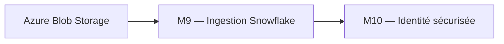
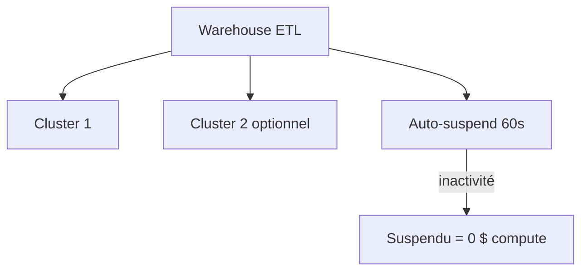
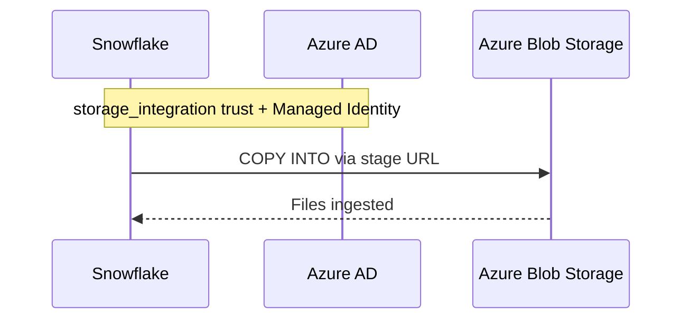

# Module 9 – Cours : Ressources Snowflake avancées

> [<- Jour 3](../README.md) · [<- Jour 2](../../day-02/README.md) · **Module 09** · [Module suivant ->](../module-10-security-auth/lab.md)

## Contexte métier

La valeur Data commence quand les fichiers Azure arrivent de façon fiable, observable et économiquement contrôlée dans Snowflake. Stages, formats et pipes forment cette chaîne d'ingestion.

## Contexte architecture



| Référentiel | Alignement |
|---|---|
| Pattern | Managed Ingestion Pipeline |
| Azure Well-Architected | Performance, Fiabilité, Coûts |
| Azure CAF | Adopt |
| Platform Engineering | Ingestion standardisée et observable |

## Pattern d'entreprise

Le pattern **Managed Ingestion Pipeline** découple format, stockage, stage et pipe afin que chaque composant soit sécurisé, testé et exploité indépendamment.

---

## 1. Warehouses & Scaling intelligent (Pilier Optimisation des Coûts)



Paramètres Terraform alignés sur les bonnes pratiques FinOps :
- `auto_suspend` bas en DEV/TEST (60s) pour minimiser les coûts d'inactivité.
- `max_cluster_count` limité (ex: 2 pour l'ETL de dev) sauf besoin de parallélisation avéré.
- Séparation stricte des charges : Warehouses dédiés à l'ETL (charges d'écriture) distincts des Warehouses d'Analytics (charges de lecture).

### Budgétisation avec les Moniteurs de Ressources (Resource Monitors)
Le pilotage budgétaire s'automatise via la ressource `snowflake_resource_monitor`. Elle permet de surveiller la consommation mensuelle de crédits et d'agir automatiquement :
- **Notification** à 75% et 90% du quota.
- **Suspension des requêtes futures** à 100% (les requêtes en cours de traitement sont finalisées).
- **Suspension immédiate** à 110% (interruption immédiate de toutes les requêtes actives).

### Structuration par Tags (Object Tagging)
Le pilier *Excellence Opérationnelle* impose de classifier l'ensemble des ressources de la plateforme de données. Les ressources `snowflake_tag` et `snowflake_tag_association` permettent d'associer des métadonnées (ex: `TAG_ENVIRONMENT` = `DEV`, `TAG_COST_CENTER` = `FINANCE`) directement sur les bases de données, schémas ou warehouses, simplifiant la répartition des coûts.


## 2. Storage Integration + Stage



Ordre de création :

1. `snowflake_storage_integration`
2. Azure AD application / Managed Identity (trust Snowflake)
3. `snowflake_stage` referencing integration
4. `snowflake_file_format`
5. `snowflake_pipe`

## 3. Exemple stage (concept)

```hcl
resource "snowflake_stage" "raw_azure" {
  name                = "STG_RAW_AZURE"
  database            = snowflake_database.raw.name
  schema              = snowflake_schema.ingestion.name
  storage_integration = snowflake_storage_integration.azure.name
  url                 = "azure://myaccount.blob.core.windows.net/raw/"
  file_format         = "FORMAT CSV"
}
```

## 4. Pipes

Snowpipe = ingestion continue + serverless (facturation séparée).

Terraform gère la définition ; les fichiers arrivent via les événements Azure Event Grid.

---

## 5. Design Patterns & Best Practices

| Pattern | Application | Pilier Well-Architected |
|---------|-------------|-------------------------|
| **Pipeline d'Ingestion** | External Stage → Snowpipe → Tables RAW. Ingestion automatisée par événements Azure Event Grid. | Fiabilité / Performance |
| **File Format Centralisé** | Un `snowflake_file_format` par format de fichier, réutilisable par plusieurs stages. | Excellence Opérationnelle |
| **Storage Integration** | Pont sécurisé entre Snowflake et Azure Blob Storage. Pas de clés d'accès statiques dans le code. | Sécurité |
| **Moniteurs de Ressources** | `snowflake_resource_monitor` avec suspension automatique en cas de dépassement de quota. | Optimisation des Coûts |
| **Tagging Métier & Technique** | `snowflake_tag` affecté via `snowflake_tag_association` pour le suivi financier. | Excellence Opérationnelle |
| **FinOps Warehouse** | Toujours `initially_suspended = true` + `auto_suspend` court (60s) pour limiter le gaspillage de crédits. | Optimisation des Coûts |

### Lab associé

Voir [lab.md](./lab.md) pour la mise en pratique complète.

---

## Navigation

[<- Course M8](../../day-02/module-08-environments/course.md) · [<- Jour 3](../README.md) · **Course M9** · [Course M10 ->](../module-10-security-auth/course.md)


