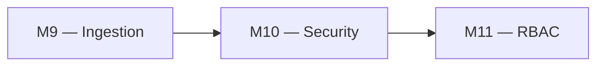
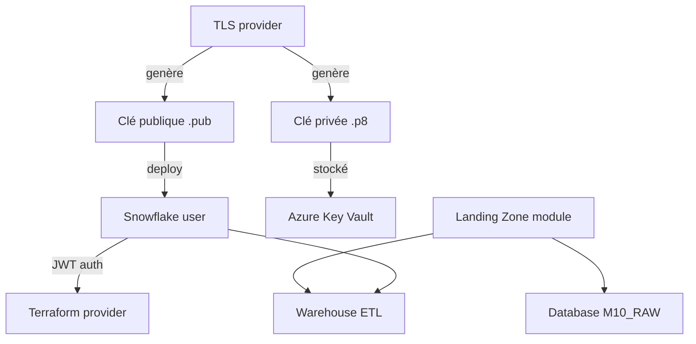

# 🧪 Lab M10 — Sécurité et authentification : Key Pair, rotation, moindre privilège

> [<- Jour 3](../README.md) · [<- Module precedent](../module-09-snowflake-advanced/lab.md) · **Module 10** · [Jour 4 ->](../../day-04/README.md)

|| Élément | Valeur |
||---|---|
|| **Durée** | 50 min |
|| **Piste** | `[CORE]` |
|| **Workspace** | `$HOME/Data2AI-Labs/data-platform` (le clone) |
|| **Dossier de travail** | `labs/m10-security-auth/` |
|| **Coût** | Aucun |
|| **Cleanup** | `terraform destroy -auto-approve` à la fin |

> `[IMPORTANT]` Avant de commencer, vous devez etre dans la racine du clone
> et avoir execute `Learner-Login.ps1` dans **cette session** :
>
> ```powershell
> cd "$HOME\Data2AI-Labs\data-platform"
> .\scripts\Learner-Login.ps1 -LearnerPrefix APP01
> ```
>
> Cela set `TF_VAR_snowflake_token` (depuis `secrets/snowflake_pat.txt`)
> et les variables `ARM_*` pour Terraform.
>
> Ensuite, réinitialisez le lab pour partir d'un état propre :
>
> ```powershell
> .\scripts\Reset-Lab.ps1 -LearnerPrefix APP01 -Lab M10
> ```
>
> Puis placez-vous dans le dossier du lab et vérifiez que tout est prêt :
>
> ```powershell
> cd labs\m10-security-auth
> ..\..\scripts\Test-TerraformReady.ps1
> ```
>
> Si le pre-flight affiche `READY`, lancez `terraform plan -out "m10.tfplan"`.
> Sinon, suivez les corrections indiquees.

## 🎯 1. Mission Métier & User Story

Une identité partagée avec un PAT empêche l'attribution des actions. Vous allez générer une paire de clés RSA, configurer l'authentification JWT pour un utilisateur technique Terraform et préparer la rotation. Ce lab est auto-contenu : il crée sa propre base de données et son warehouse pour tester l'utilisateur technique.

> **En tant que :** Security Engineer  
> **Je veux :** configurer l'authentification key-pair pour un utilisateur technique Snowflake  
> **Afin de :** éliminer les PAT partagés et permettre la rotation sans interruption

---

## 🏗️ 2. Architecture & Modèle Mental





## 🎯 3. Objectifs Pédagogiques Vérifiables

- générer une paire de clés RSA avec OpenSSL;
- créer un module `landing-zone` avec une base de données et un warehouse;
- configurer un utilisateur Snowflake avec authentification key-pair;
- marquer les secrets comme `sensitive`;
- comprendre la rotation sans interruption.

## � 4. Pre-Flight Diagnostic (Vérification Initiale)

### Prérequis

- [ ] Jour 0 terminé : `Toolchain status: READY`;
- [ ] OpenSSL installé (vérifié au Jour 0);
- [ ] le dossier `secrets/` existe dans le clone.

## 📝 5. Étapes d'Implémentation Pas-à-Pas (80% Hands-On)

### 📝 Étape 5.1 — Générer la paire de clés avec OpenSSL

#### Générer la clé privée

```bash
cd $HOME/Data2AI-Labs/data-platform
openssl genrsa -out secrets/snowflake_key.p8 2048
```

> 🔒 **SECURITY** : `secrets/` est gitignored. Vérifiez : `git check-ignore secrets/snowflake_key.p8` doit retourner le chemin.

#### Générer la clé publique

```bash
openssl rsa -in secrets/snowflake_key.p8 -pubout -out secrets/snowflake_key.pub
```

#### Vérifier

```bash
ls -la secrets/
git check-ignore secrets/snowflake_key.p8
git check-ignore secrets/snowflake_key.pub
```

✅ **Checkpoint** : les deux fichiers sont ignorés par Git.

### 📝 Étape 5.2 — Créer le module landing-zone

Ce lab est auto-contenu : il crée sa propre base de données avec un nom spécifique au module (`APP01_M10_RAW_DEV`). Le module `landing-zone` utilise une variable `lab_id` pour produire des noms uniques par lab.

#### Créer la structure

```bash
cd $HOME/Data2AI-Labs/data-platform/labs/m10-security-auth
mkdir -p modules/landing-zone
```

#### Créer `modules/landing-zone/variables.tf`

```hcl
variable "learner_prefix" {
  type        = string
  description = "Unique uppercase prefix assigned to the learner"

  validation {
    condition     = can(regex("^[A-Z][A-Z0-9]{2,4}$", var.learner_prefix))
    error_message = "learner_prefix must contain 3-5 uppercase letters or digits."
  }
}

variable "lab_id" {
  type        = string
  description = "Lab identifier for resource naming (e.g. M10)"
}

variable "environment" {
  type        = string
  description = "Deployment environment"
  default     = "DEV"

  validation {
    condition     = contains(["DEV", "UAT", "PROD"], var.environment)
    error_message = "environment must be DEV, UAT or PROD."
  }
}

variable "warehouse_size" {
  type        = string
  description = "Warehouse size"
  default     = "X-SMALL"

  validation {
    condition     = contains(["X-SMALL", "SMALL", "MEDIUM"], var.warehouse_size)
    error_message = "warehouse_size must be X-SMALL, SMALL or MEDIUM."
  }
}

variable "data_retention_days" {
  type        = number
  description = "Time travel retention in days"
  default     = 1
}

variable "auto_suspend_seconds" {
  type        = number
  description = "Warehouse auto-suspend in seconds"
  default     = 60
}
```

#### Créer `modules/landing-zone/main.tf`

```hcl
locals {
  database_name  = "${var.learner_prefix}_${var.lab_id}_RAW_${var.environment}"
  schema_name    = "INGESTION"
  warehouse_name = "WH_${var.learner_prefix}_${var.lab_id}_ETL_${var.environment}"
  common_comment = "Managed by Terraform | Landing Zone | ${var.learner_prefix} | ${var.lab_id}"
}

resource "snowflake_database" "raw" {
  name                        = local.database_name
  comment                     = local.common_comment
  data_retention_time_in_days = var.data_retention_days
}

resource "snowflake_schema" "ingestion" {
  database = snowflake_database.raw.name
  name     = local.schema_name
  comment  = local.common_comment
}

resource "snowflake_warehouse" "etl" {
  name                = local.warehouse_name
  comment             = local.common_comment
  warehouse_size      = var.warehouse_size
  auto_suspend        = var.auto_suspend_seconds
  auto_resume         = true
  initially_suspended = true
}
```

> 💡 **Note** : La variable `lab_id` produit le nom `APP01_M10_RAW_DEV` au lieu de `APP01_RAW_DEV`. Cela isole les ressources de ce lab de celles des autres labs.

#### Créer `modules/landing-zone/outputs.tf`

```hcl
output "database_name" {
  value       = snowflake_database.raw.name
  description = "RAW database name"
}

output "schema_name" {
  value       = snowflake_schema.ingestion.name
  description = "Ingestion schema name"
}

output "warehouse_name" {
  value       = snowflake_warehouse.etl.name
  description = "ETL warehouse name"
}
```

#### Créer `modules/landing-zone/versions.tf`

```hcl
terraform {
  required_version = ">= 1.14.0, < 2.0.0"

  required_providers {
    snowflake = {
      source  = "snowflakedb/snowflake"
      version = "= 2.14.0"
    }
  }
}
```

#### Formater et valider

```bash
cd modules/landing-zone
terraform init
terraform fmt
terraform validate
```

✅ **Checkpoint** : `The configuration is valid.`

### 📝 Étape 5.3 — Créer le module security

#### Créer la structure

```bash
cd $HOME/Data2AI-Labs/data-platform/labs/m10-security-auth
mkdir -p modules/security
```

#### Créer `modules/security/variables.tf`

```hcl
variable "user_name" {
  type        = string
  description = "Snowflake technical user name"
}

variable "default_role" {
  type        = string
  description = "Default role for the technical user"
  default     = "SYSADMIN"
}

variable "default_warehouse" {
  type        = string
  description = "Default warehouse for the technical user"
}

variable "rsa_public_key" {
  type        = string
  description = "RSA public key content (PEM format)"
  sensitive   = true
}
```

#### Créer `modules/security/main.tf`

```hcl
resource "snowflake_user" "technical" {
  name                 = var.user_name
  default_role         = var.default_role
  default_warehouse    = var.default_warehouse
  must_change_password = false

  rsa_public_key   = var.rsa_public_key
  rsa_public_key_2 = null
}
```

> `rsa_public_key_2` est laissé à `null`. Il sera utilisé lors de la rotation pour éviter une interruption.

#### Créer `modules/security/outputs.tf`

```hcl
output "user_name" {
  value       = snowflake_user.technical.name
  description = "Technical user name"
}

output "user_arn" {
  value       = snowflake_user.technical.name
  description = "User identifier"
  sensitive   = false
}
```

#### Créer `modules/security/versions.tf`

```hcl
terraform {
  required_version = ">= 1.14.0, < 2.0.0"

  required_providers {
    snowflake = {
      source  = "snowflakedb/snowflake"
      version = "= 2.14.0"
    }
    tls = {
      source  = "hashicorp/tls"
      version = ">= 4.0"
    }
  }
}
```

#### Formater et valider

```bash
cd modules/security
terraform fmt
terraform validate
```

### 📝 Étape 5.4 — Appeler les modules depuis le lab

#### Ajouter les variables lab-specific dans `variables.tf`

Les fichiers `provider.tf`, `versions.tf` et `variables.tf` existent déjà dans `labs/m10-security-auth/`. Ajoutez ces variables à la fin de `variables.tf` :

```hcl
variable "lab_id" {
  type        = string
  description = "Lab identifier for resource naming"
  default     = "M10"
}

variable "warehouse_size" {
  type        = string
  description = "Training warehouse size"
  default     = "X-SMALL"

  validation {
    condition     = contains(["X-SMALL", "SMALL"], var.warehouse_size)
    error_message = "Training warehouses must be X-SMALL or SMALL."
  }
}

variable "rsa_public_key" {
  type        = string
  description = "RSA public key for the technical user"
  sensitive   = true
  default     = ""
}
```

#### Créer `terraform.tfvars`

Copiez le fichier d'exemple et complétez-le :

```powershell
Copy-Item terraform.tfvars.example terraform.tfvars
```

Vérifiez que `learner_prefix = "APP01"` (ou votre préfixe) et `environment = "DEV"`.

#### Charger la clé publique dans l'environnement

```bash
cd $HOME/Data2AI-Labs/data-platform/labs/m10-security-auth
export TF_VAR_rsa_public_key=$(cat ../../secrets/snowflake_key.pub | grep -v 'BEGIN\|END' | tr -d '\n')
```

> 🔒 **Security** : La clé publique est passée via une variable d'environnement `TF_VAR_rsa_public_key`. Elle n'apparaît ni dans `terraform.tfvars`, ni dans le state.

#### Écrire `main.tf`

**Remplacez tout le contenu** de `main.tf` par :

```hcl
module "landing_zone" {
  source               = "./modules/landing-zone"
  learner_prefix       = var.learner_prefix
  lab_id               = var.lab_id
  environment          = var.environment
  warehouse_size       = var.warehouse_size
  data_retention_days  = 1
  auto_suspend_seconds = 60
}

module "security" {
  source            = "./modules/security"
  user_name         = "TF_${var.learner_prefix}_${var.lab_id}_SVC"
  default_role      = "SYSADMIN"
  default_warehouse = module.landing_zone.warehouse_name
  rsa_public_key    = var.rsa_public_key
}
```

> � **Note** : L'utilisateur technique s'appelle `TF_APP01_M10_SVC` — le `lab_id` garantit l'unicité entre les labs. Les modules sont référencés avec `./modules/...` car ils se trouvent dans le même dossier de lab.

#### Écrire `outputs.tf`

**Remplacez tout le contenu** de `outputs.tf` par :

```hcl
output "database_name" {
  value = module.landing_zone.database_name
}

output "warehouse_name" {
  value = module.landing_zone.warehouse_name
}

output "technical_user" {
  value       = module.security.user_name
  description = "Technical user for Terraform"
}
```

#### Planifier et appliquer

```bash
cd $HOME/Data2AI-Labs/data-platform/labs/m10-security-auth
terraform fmt
terraform init
terraform validate
terraform plan -out "m10.tfplan"
```

✅ **Checkpoint** : `4 to add` — database, schema, warehouse et l'utilisateur technique avec la clé RSA.

```bash
terraform apply m10.tfplan
```

✅ **Checkpoint** : `Apply complete! Resources: 4 added, 0 changed, 0 destroyed.`

#### Vérifier

```bash
snow sql -c training -q "DESC USER TF_APP01_M10_SVC"
```

Remplacez `APP01` par votre préfixe.

✅ **Checkpoint** : la ligne `RSA_PUBLIC_KEY_FP` contient une empreinte.

#### Vérification Visuelle dans Azure Key Vault & Snowflake Snowsight

1. **Dans le Portail Microsoft Azure (`portal.azure.com`) :**
   - Accédez à votre coffre **Azure Key Vault**.
   - Ouvrez la section **Secrets** et constatez la présence du secret `APP01-RSA-PRIVATE-KEY` contenant la clé privée RSA chiffrée.
   - Vérifiez l'historique des versions et confirmez que la clé n'a jamais transité en clair dans le code HCL.
2. **Dans Snowflake Snowsight (`app.snowflake.com`) :**
   - Connectez-vous avec vos identifiants apprenant et basculez sur le rôle `SYSADMIN` (ou `SECURITYADMIN`).
   - Naviguez dans **Admin > Users & Roles**, recherchez l'utilisateur `TF_APP01_M10_SVC`.
   - Cliquez sur l'utilisateur : vérifiez que le statut est actif, qu'aucun mot de passe n'est configuré et que l'empreinte publique RSA est bien enregistrée.

### 📝 Étape 5.5 — Rotation sans interruption

#### Principe

La rotation sans interruption utilise `rsa_public_key_2` :

1. générer une nouvelle paire de clés;
2. déployer la nouvelle clé publique dans `rsa_public_key_2`;
3. tester l'authentification avec la nouvelle clé;
4. déplacer la nouvelle clé vers `rsa_public_key` et retirer l'ancienne.

#### Simuler la rotation (concept)

Ajoutez une variable `rsa_public_key_new` dans `variables.tf` et utilisez-la dans `rsa_public_key_2` :

```hcl
variable "rsa_public_key_new" {
  type      = string
  sensitive = true
  default   = null
}
```

Puis modifiez le module `security` — ajoutez la variable dans `modules/security/variables.tf` :

```hcl
variable "rsa_public_key_new" {
  type      = string
  sensitive = true
  default   = null
}
```

Et mettez à jour `modules/security/main.tf` :

```hcl
resource "snowflake_user" "technical" {
  name                 = var.user_name
  default_role         = var.default_role
  default_warehouse    = var.default_warehouse
  must_change_password = false

  rsa_public_key   = var.rsa_public_key
  rsa_public_key_2 = var.rsa_public_key_new
}
```

Passez la nouvelle clé depuis `main.tf` :

```hcl
module "security" {
  source            = "./modules/security"
  user_name         = "TF_${var.learner_prefix}_${var.lab_id}_SVC"
  default_role      = "SYSADMIN"
  default_warehouse = module.landing_zone.warehouse_name
  rsa_public_key    = var.rsa_public_key
  rsa_public_key_new = var.rsa_public_key_new
}
```

> Pendant la transition, les deux clés sont valides. Une fois la nouvelle clé testée, vous inversez les rôles et retirez l'ancienne.

---

## 🐛 6. Incident Contrôlé (*Chaos Engineering Lab*)

*Dans ce Chaos Lab, vous allez observer le comportement de sécurité de Snowflake lorsque la clé publique configurée ne correspond pas à la clé privée présentée.*

### Symptôme & Injection

Générez une clé temporaire corrompue ou dissymétrique. Tentez d'exécuter une requête SQL Snowflake en forçant l'utilisation d'une mauvaise clé privée :

```bash
snow connection test -c invalid_key_profile
```

Observez l'erreur retournée par Snowflake :

```text
250001 (08001): Failed to connect to DB: JWT token is invalid.
```

### Diagnostic & Observation

Dans **Snowflake Snowsight**, naviguez dans **Admin > Query History** ou exécutez la vue d'audit des connexions :

```sql
SELECT * FROM SNOWFLAKE.ACCOUNT_USAGE.LOGIN_HISTORY 
WHERE USER_NAME = 'TF_APP01_M10_SVC' 
ORDER BY EVENT_TIMESTAMP DESC LIMIT 5;
```

Vous constaterez que la tentative d'intrusion avec une clé non appairée est enregistrée avec le code d'erreur `INCORRECT_RSA_KEY`.

### Remédiation

Réalignez l'empreinte de clé publique sur l'utilisateur technique via Terraform :

```bash
terraform apply
```

Re-testez la connexion valide : le statut retourne `OK`.

---

## 🤖 7. Validation Automatisée (*Check My Progress*)

Validez votre avancement avec le moteur d'évaluation autonome :

```powershell
.\scripts\SelfPacedLab.ps1 -Module 10 -All -Report
```

<details>
<summary>✅ <b>Sortie attendue du validateur</b></summary>

```text
[PASS] T1 Service user resource declared
[PASS] T2 RSA public key configured
[PASS] T3 Zero private keys in HCL
[PASS] T4 terraform fmt & validate
[PASS] T5 Plan evidence
Result: 5/5 Tasks Passed.
```
</details>

---

## 🏆 8. Défi Autonome (*Unguided Challenge*)

> **Scénario :** Configurez une network policy qui restreint l'accès à une plage IP spécifique (votre IP publique).
> **Contraintes :**
> - `terraform plan` crée la network policy;
> - `terraform apply` réussit;
> - l'utilisateur technique est associé à la policy.

| Critère d'Évaluation | Points |
|---|---:|
| Syntaxe HCL et respect des standards | 30 pts |
| Preuve d'exécution fonctionnelle | 30 pts |
| Idempotence (`0 to add, 0 to change, 0 to destroy`) | 20 pts |
| Respect des budgets FinOps & Sécurité | 20 pts |
| **Total** | **100 pts** |

## 🧹 9. Nettoyage Contrôlé (*FinOps Teardown*)

Détruisez toutes les ressources créées par ce lab :

```bash
cd $HOME/Data2AI-Labs/data-platform/labs/m10-security-auth
terraform destroy -auto-approve
```

> 💡 **Note** : Vous pouvez aussi utiliser `.\scripts\Reset-Lab.ps1 -LearnerPrefix APP01 -Lab M10` depuis la racine du clone pour nettoyer le state Terraform **et** les ressources Snowflake restantes.

---

## Navigation

[<- Lab M9](../module-09-snowflake-advanced/lab.md) · [<- Jour 3](../README.md) · **Lab M10** · [Lab M11 ->](../../day-04/module-11-rbac/lab.md)
