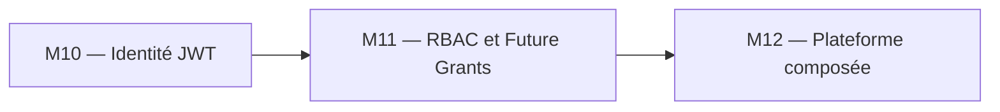
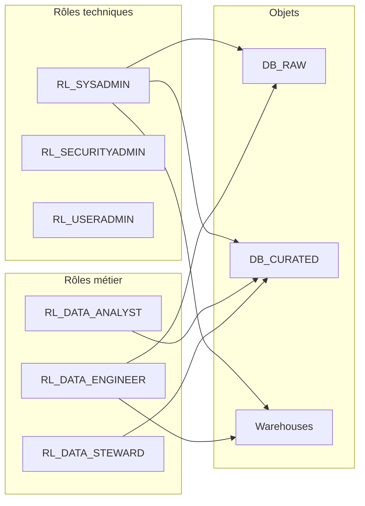

# Module 11 – Cours : RBAC Scalable

> [<- Jour 4](../README.md) · [<- Jour 3](../../day-03/README.md) · **Module 11** · [Module suivant ->](../module-12-capstone/lab.md)

## Contexte métier

L'accès aux données doit suivre les fonctions métier sans tickets manuels ni privilèges permanents. Une hiérarchie data-driven et les Future Grants appliquent le moindre privilège à l'échelle.

## Contexte architecture



| Référentiel | Alignement |
|---|---|
| Pattern | RBAC Hierarchy and Future Grants |
| Azure Well-Architected | Sécurité, Excellence opérationnelle |
| Azure CAF | Govern |
| Platform Engineering | Autorisation self-service gouvernée |

## Pattern d'entreprise

Le pattern **RBAC Hierarchy and Future Grants** sépare rôles d'accès, rôles fonctionnels et rôles système, puis automatise les droits sur les futurs objets.

---

## 1. Modèle de rôles




## 2. Grants Terraform

```hcl
resource "snowflake_grant_privileges_to_account_role" "etl_usage_wh" {
  account_role_name = snowflake_account_role.etl.name
  privileges        = ["USAGE"]
  on_account_object {
    object_type = "WAREHOUSE"
    object_name = snowflake_warehouse.etl.name
  }
}
```

## 3. Future Grants – Pourquoi ?

Sans future grants : chaque nouvelle table ou vue créée dans la base `curated` nécessite un grant manuel de privilèges. C'est inefficace et cela introduit des risques d'oublis ou d'incohérences de privilèges.

Avec les future grants (Standard d'entreprise sous le provider Snowflake v2.x) :

```hcl
resource "snowflake_grant_privileges_to_account_role" "analyst_future_select_tables" {
  account_role_name = snowflake_account_role.analyst.name
  privileges        = ["SELECT"]

  on_schema_object {
    future {
      object_type_plural = "TABLES"
      in_database        = var.curated_database_name
    }
  }
}
```


## 4. Audit

```sql
SHOW GRANTS TO ROLE RL_DATA_ANALYST_DEV;
```

Puis `terraform plan` — doit rester stable après création d'objets dynamiques (schemas `for_each`).

> **Important** : Utiliser `SHOW FUTURE GRANTS ON DATABASE DB_CURATED_DEV;` pour vérifier que les permissions automatiques sont correctement configurées.

---

## 5. Design Patterns & Best Practices

| Pattern | Application | Pilier Well-Architected |
|---------|-------------|-------------------------|
| **Role Hierarchy** | `SYSADMIN` → `RL_SYSADMIN` → `RL_DATA_ENGINEER` → `RL_DATA_ANALYST` → `RL_DATA_STEWARD`. Héritage des permissions. | Sécurité |
| **Moindre Privilège** | Chaque rôle a strictement les droits nécessaires à sa fonction. | Sécurité |
| **Future Grants** | Bloc `future` dans les grants pour des permissions automatiques sur les objets futurs. | Sécurité / Fiabilité |
| **Naming Convention** | `RL_{DOMAIN}_{ENV}` (ex: `RL_DATA_ENGINEER_DEV`). Standard clair, lisible, auditable. | Excellence Opérationnelle |
| **Grants Granulaires** | Privileges au niveau database, schema, ou `object_type` selon le besoin. | Sécurité |
| **Audit Continu** | `SHOW GRANTS` + `SHOW FUTURE GRANTS` + script d'audit `ACCOUNT_USAGE`. | Sécurité / Excellence Opérationnelle |

### Lab associé

Voir [lab.md](./lab.md) pour la mise en pratique complète.

---

## Navigation

[<- Course M10](../../day-03/module-10-security-auth/course.md) · [<- Jour 4](../README.md) · **Course M11** · [Course M12 ->](../module-12-capstone/course.md)


