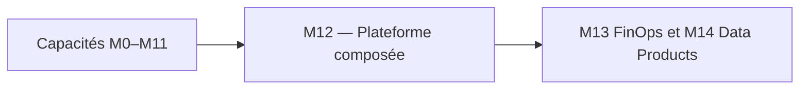
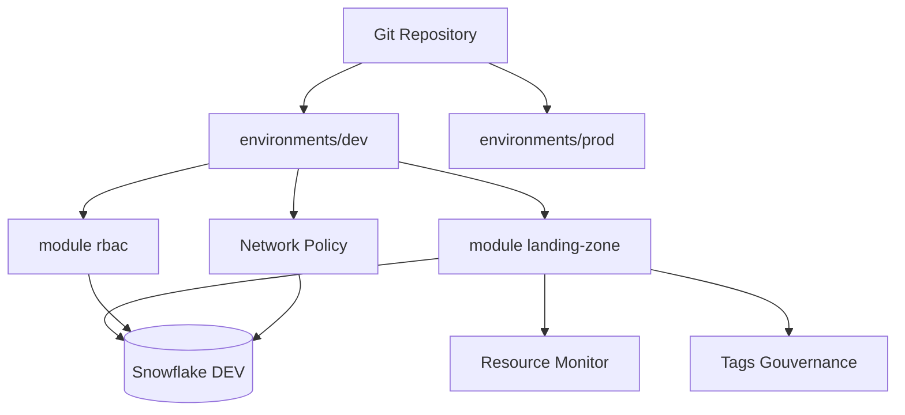

# Module 12 – Cours : Projet Fil Rouge

> [<- Jour 4](../README.md) · [<- Module precedent](../module-11-rbac/lab.md) · **Module 12** · [Module suivant ->](../module-13-finops-observability/lab.md)

## Contexte métier

Le comité d'architecture attend une plateforme gouvernée, exploitable et auditable plutôt qu'une collection de ressources. Le capstone assemble les capacités précédentes et démontre le zero-drift.

## Contexte architecture

| Référentiel | Alignement |
|---|---|
| Pattern | Composed Enterprise Platform |
| Azure Well-Architected | Les cinq piliers |
| Azure CAF | Manage |
| Platform Engineering | Produit plateforme intégré et exploitable |

## Pattern d'entreprise

Le pattern **Composed Enterprise Platform** assemble des modules à contrat stable, des providers à rôles séparés, une CI/CD gouvernée et une validation zero-drift.

---

## 1. Architecture cible

Le capstone assemble tous les modules et illustre une plateforme de données gouvernée alignée sur le **Well-Architected Framework** :

| Composant | Source | Pilier Well-Architected |
|-----------|--------|-------------------------|
| Landing Zone | `modules/landing-zone` | Performance / Fiabilité |
| RBAC & Future Grants | `modules/rbac` | Sécurité |
| Resource Monitors | `modules/landing-zone` | Optimisation des Coûts |
| Object Tagging | `modules/landing-zone` | Excellence Opérationnelle |
| Network Policy | Capstone `main.tf` | Sécurité |
| CI/CD Pipeline | `azure-pipelines.yml` / `.github/workflows/terraform.yml` | Excellence Opérationnelle |

## 2. Déroulé recommandé (2h)

| Phase | Durée | Action | Pilier |
|-------|-------|--------|--------|
| Bootstrap | 15 min | Backend Azure Blob, secrets, clé privée | Sécurité / Fiabilité |
| Deploy DEV | 30 min | Apply landing + rbac + resource monitor + tags | Performance / Coûts |
| Ingestion | 20 min | Stage + file format | Performance |
| CI | 20 min | PR + merge (GitHub Actions ou Azure Pipelines) | Excellence Opérationnelle |
| Audit | 15 min | Plan zero-diff + `SHOW GRANTS` + `SHOW FUTURE GRANTS` | Sécurité |
| Rétro | 20 min | Documentation, runbook, comparaison Well-Architected | Excellence Opérationnelle |

## 3. Livrables participants

1. Repo Git avec structure standard (modules + environments)
2. Diagramme d'architecture (export Mermaid ou draw.io)
3. Runbook de promotion DEV → PROD (incluant les approbations d'environnement CI/CD)
4. Capture `terraform plan` stable (`No changes`)
5. Grille d'auto-évaluation Well-Architected (voir section 6)

## 4. Critères d'expertise

L'équipe est autonome si elle peut :

- Onboarder une nouvelle database via module + `for_each`
- Importer une ressource legacy sans interruption de service
- Expliquer le contenu du state et du lock
- Diagnostiquer un drift (UI vs Terraform) et le corriger
- Configurer un moniteur de ressources pour capper un budget
- Mettre en place des Future Grants pour un nouveau rôle métier

---

## 5. Design Patterns & Best Practices

| Pattern | Application dans le Capstone | Pilier Well-Architected |
|---------|------------------------------|-------------------------|
| **Composition de Modules** | `landing-zone` + `rbac` orchestrés dans un même root module. | Excellence Opérationnelle |
| **Cross-Module References** | `module.rbac` utilise `module.landing_zone.warehouse_names["etl"]`. | Excellence Opérationnelle |
| **State Isolation** | State Azure Blob dédié au capstone. Indépendant des labs précédents. | Fiabilité |
| **CI/CD Intégré** | Plan on PR, apply on merge. Validation complète (fmt, tflint, tfsec). | Excellence Opérationnelle |
| **Dérive (Drift)** | `terraform plan` détecte les modifications manuelles. Ré-apply pour corriger. | Fiabilité |
| **Resource Monitors** | Budget cappé par `snowflake_resource_monitor` avec alertes et suspension. | Optimisation des Coûts |
| **Future Grants** | Permissions automatiques sur les objets futurs, sans intervention manuelle. | Sécurité |
| **Network Policies** | Restriction d'accès réseau aux agents CI et aux IPs internes. | Sécurité |
| **Object Tagging** | Classification des ressources par `TAG_ENVIRONMENT` et `TAG_COST_CENTER`. | Excellence Opérationnelle |
| **FinOps Monitoring** | Vue `ACCOUNT_USAGE` pour le suivi des crédits, dbt_snowflake_monitoring. | Optimisation des Coûts |
| **Snow CLI** | Création de Data Products via Snow CLI (`snow`), déploiement de modèles dbt. | Excellence Opérationnelle |
| **Zéro Dérive Final** | `terraform plan = No changes`. L'infrastructure correspond exactement au code. | Fiabilité |

---

## 6. Grille d'auto-évaluation Well-Architected

| Pilier | Question d'audit | Validé ? |
|--------|------------------|----------|
| **Sécurité** | L'authentification utilise-t-elle Key-Pair JWT (pas de mot de passe) ? | |
| **Sécurité** | Les Future Grants couvrent-ils tous les objets futurs dans `curated` ? | |
| **Sécurité** | Une Network Policy est-elle définie pour restreindre les connexions ? | |
| **Fiabilité** | Le state est-il stocké sur un backend distant avec locking ? | |
| **Fiabilité** | `terraform plan` retourne-t-il `No changes` après le déploiement ? | |
| **Coûts** | Un Resource Monitor est-il associé à chaque warehouse ? | |
| **Coûts** | `auto_suspend` est-il configuré à 60s ou moins en DEV ? | |
| **Coûts** | Les vues `ACCOUNT_USAGE` sont-elles utilisées pour le suivi FinOps ? | |
| **Performance** | Les warehouses sont-ils dimensionnés selon le workload (ETL vs Analytics) ? | |
| **Ops** | Les tags `TAG_ENVIRONMENT` et `TAG_COST_CENTER` sont-ils appliqués ? | |
| **Ops** | Le pipeline CI/CD exécute-t-il `tflint` + `tfsec` avant le plan ? | |
| **Ops** | Snow CLI est-il utilisé pour créer et déployer des Data Products ? | |

### Lab associé

Voir [lab.md](./lab.md) pour la mise en pratique complète. La grille d'évaluation du lab permet de valider chaque compétence.

---

## Navigation

[<- Course M11](../module-11-rbac/course.md) · [<- Jour 4](../README.md) · **Course M12** · [Course M13 ->](../module-13-finops-observability/course.md)

