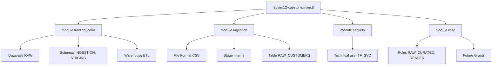
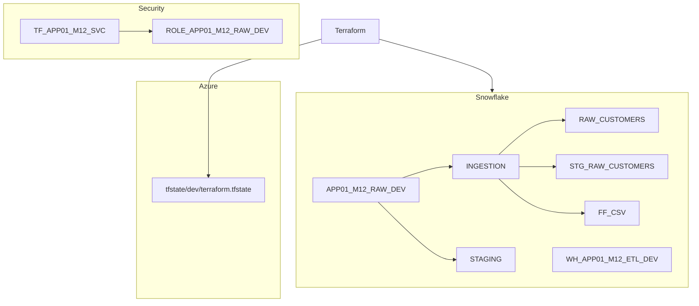

# 🧪 Lab M12 — Capstone : Plateforme de données complète

> [<- Jour 4](../README.md) · [<- Module precedent](../module-11-rbac/lab.md) · **Module 12** · [Module suivant ->](../module-13-finops-observability/lab.md)

|| Élément | Valeur |
||---|---|
|| **Durée** | 120 min |
|| **Piste** | `[CORE]` |
|| **Workspace** | `$HOME/Data2AI-Labs/data-platform` (le clone) |
|| **Dossier de travail** | `labs/m12-capstone/` |
|| **Coût** | Warehouses X-SMALL |
|| **Cleanup** | `terraform destroy -auto-approve` à la fin |

> `[IMPORTANT]` Avant de commencer, vous devez etre dans la racine du clone
> et avoir execute `Learner-Login.ps1` dans **cette session** :
>
> ```powershell
> cd "$HOME\Data2AI-Labs\data-platform"
> .\scripts\Learner-Login.ps1 -LearnerPrefix APP01
> ```
>
> Cela set `TF_VAR_snowflake_token` (depuis `secrets/snowflake_pat.txt`)
> et les variables `ARM_*` pour Terraform.
>
> Ensuite, réinitialisez le lab pour partir d'un état propre :
>
> ```powershell
> .\scripts\Reset-Lab.ps1 -LearnerPrefix APP01 -Lab M12
> ```
>
> Puis placez-vous dans le dossier du lab et vérifiez que tout est pret :
>
> ```powershell
> cd "$HOME\Data2AI-Labs\data-platform\labs\m12-capstone"
> ..\..\scripts\Test-TerraformReady.ps1
> ```
>
> Si le pre-flight affiche `READY`, lancez `terraform plan -out "m12.tfplan"`.
> Sinon, suivez les corrections indiquees.

## 🎯 1. Mission Métier & User Story

Le comité d'architecture attend une plateforme gouvernée, exploitable et auditable. Vous allez assembler tous les modules (landing-zone, ingestion, security, RBAC) dans une configuration complète et prouver le zero-drift.

> **En tant que :** Data Platform Engineer  
> **Je veux :** assembler tous les modules dans une configuration Capstone unique  
> **Afin de :** prouver le zero-drift et la gouvernance de la plateforme complète

---

## 🏗️ 2. Architecture & Modèle Mental



## 🎯 3. Objectifs Pédagogiques Vérifiables

- composer tous les modules dans une configuration unique;
- déployer la plateforme complète en une seule commande;
- prouver le zero-drift avec `terraform plan -detailed-exitcode`;
- documenter l'architecture avec les outputs.

## � 4. Pre-Flight Diagnostic (Vérification Initiale)

### Prérequis

- [ ] Le dossier `labs/m12-capstone/` contient `provider.tf`, `versions.tf`, `variables.tf` et `terraform.tfvars.example` (fournis).
- [ ] Les sous-dossiers `labs/m12-capstone/modules/landing-zone/`, `modules/ingestion/`, `modules/security/` et `modules/rbac/` existent (avec `versions.tf` fourni).

## 📝 5. Étapes d'Implémentation Pas-à-Pas (80% Hands-On)

### 📝 Étape 5.1 — Créer les modules

Ce lab est autonome : les 4 modules sont créés dans `labs/m12-capstone/modules/` puis assemblés dans `main.tf`.

#### Créer `modules/landing-zone/`

`modules/landing-zone/variables.tf` :

```hcl
variable "learner_prefix" {
  type        = string
  description = "Learner prefix"
}

variable "environment" {
  type        = string
  description = "Deployment environment"
  default     = "DEV"
}

variable "warehouse_size" {
  type        = string
  default     = "X-SMALL"
}

variable "data_retention_days" {
  type        = number
  default     = 1
}

variable "auto_suspend_seconds" {
  type        = number
  default     = 60
}

variable "schemas" {
  type = map(object({
    name    = string
    comment = string
  }))
}

variable "warehouses" {
  type = map(object({
    size        = string
    auto_suspend = number
    comment      = string
  }))
}
```

`modules/landing-zone/main.tf` :

```hcl
locals {
  db_name = "${var.learner_prefix}_M12_RAW_${var.environment}"
}

resource "snowflake_database" "this" {
  name    = local.db_name
  comment = "Landing zone database for ${var.learner_prefix} M12"
}

resource "snowflake_schema" "this" {
  for_each = var.schemas

  database = snowflake_database.this.name
  name     = each.value.name
  comment  = each.value.comment
}

resource "snowflake_warehouse" "this" {
  for_each = var.warehouses

  name                = "WH_${var.learner_prefix}_M12_${upper(each.key)}_${var.environment}"
  warehouse_size      = each.value.size
  auto_suspend        = each.value.auto_suspend
  auto_resume         = true
  initially_suspended = true
  comment             = each.value.comment
}
```

`modules/landing-zone/outputs.tf` :

```hcl
output "database_name" {
  value = snowflake_database.this.name
}

output "schema_names" {
  value = { for k, v in snowflake_schema.this : k => v.name }
}

output "warehouse_names" {
  value = { for k, v in snowflake_warehouse.this : k => v.name }
}
```

#### Créer `modules/ingestion/`

`modules/ingestion/variables.tf` :

```hcl
variable "database" {
  type        = string
  description = "Target database name"
}

variable "schema" {
  type        = string
  description = "Target schema name"
  default     = "INGESTION"
}

variable "table_name" {
  type        = string
  description = "RAW table name"
}

variable "stage_name" {
  type        = string
  description = "Internal stage name"
}
```

`modules/ingestion/main.tf` :

```hcl
resource "snowflake_file_format" "csv" {
  database  = var.database
  schema    = var.schema
  name      = "FF_CSV"
  format_type = "CSV"
}

resource "snowflake_stage" "this" {
  database  = var.database
  schema    = var.schema
  name      = var.stage_name
  file_format = snowflake_file_format.csv.name
}

resource "snowflake_table" "this" {
  database = var.database
  schema   = var.schema
  name     = var.table_name

  column {
    name = "ID"
    type = "NUMBER(38,0)"
  }

  column {
    name = "NAME"
    type = "VARCHAR(16777216)"
  }
}
```

`modules/ingestion/outputs.tf` :

```hcl
output "table_name" {
  value = snowflake_table.this.name
}

output "stage_name" {
  value = snowflake_stage.this.name
}
```

#### Créer `modules/security/`

`modules/security/variables.tf` :

```hcl
variable "user_name" {
  type        = string
  description = "Snowflake technical user name"
}

variable "default_role" {
  type        = string
  description = "Default role for the technical user"
  default     = "SYSADMIN"
}

variable "default_warehouse" {
  type        = string
  description = "Default warehouse for the technical user"
}

variable "rsa_public_key" {
  type        = string
  description = "RSA public key content (PEM format)"
  sensitive   = true
  default     = null
}
```

`modules/security/main.tf` :

```hcl
resource "snowflake_user" "technical" {
  name                 = var.user_name
  default_role         = var.default_role
  default_warehouse    = var.default_warehouse
  must_change_password = false
  rsa_public_key       = var.rsa_public_key
  rsa_public_key_2     = null
}
```

`modules/security/outputs.tf` :

```hcl
output "user_name" {
  value       = snowflake_user.technical.name
  description = "Technical user name"
}
```

#### Créer `modules/rbac/`

`modules/rbac/variables.tf` :

```hcl
variable "learner_prefix" {
  type        = string
  description = "Learner prefix for role naming"
}

variable "environment" {
  type        = string
  description = "Deployment environment"
  default     = "DEV"
}

variable "database_name" {
  type        = string
  description = "RAW database name"
}

variable "schema_name" {
  type        = string
  description = "Schema name for grants"
  default     = "INGESTION"
}
```

`modules/rbac/main.tf` :

```hcl
locals {
  role_raw     = "ROLE_${var.learner_prefix}_M12_RAW_${var.environment}"
  role_curated = "ROLE_${var.learner_prefix}_M12_CUR_${var.environment}"
  role_reader  = "ROLE_${var.learner_prefix}_M12_RDR_${var.environment}"
}

resource "snowflake_account_role" "raw" {
  name    = local.role_raw
  comment = "RAW access role for ${var.learner_prefix} M12"
}

resource "snowflake_account_role" "curated" {
  name    = local.role_curated
  comment = "Curated access role for ${var.learner_prefix} M12"
}

resource "snowflake_account_role" "reader" {
  name    = local.role_reader
  comment = "Read-only role for ${var.learner_prefix} M12"
}

resource "snowflake_grant_privileges_to_account_role" "curated_to_raw" {
  privileges        = ["USAGE"]
  account_role_name = snowflake_account_role.raw.name
  on_account_role   = snowflake_account_role.curated.name
}

resource "snowflake_grant_privileges_to_account_role" "reader_to_curated" {
  privileges        = ["USAGE"]
  account_role_name = snowflake_account_role.curated.name
  on_account_role   = snowflake_account_role.reader.name
}

resource "snowflake_grant_privileges_to_account_role" "raw_db" {
  privileges        = ["USAGE"]
  account_role_name = snowflake_account_role.raw.name

  on_schema {
    schema_name = "${var.database_name}.${var.schema_name}"
  }
}

resource "snowflake_grant_privileges_to_account_role" "future_tables" {
  privileges        = ["SELECT", "INSERT", "UPDATE"]
  account_role_name = snowflake_account_role.raw.name

  on_schema_object {
    future {
      database_name = var.database_name
      schema_name   = var.schema_name
      object_type   = "TABLE"
    }
  }
}

resource "snowflake_grant_privileges_to_account_role" "reader_future" {
  privileges        = ["SELECT"]
  account_role_name = snowflake_account_role.reader.name

  on_schema_object {
    future {
      database_name = var.database_name
      schema_name   = var.schema_name
      object_type   = "TABLE"
    }
  }
}
```

`modules/rbac/outputs.tf` :

```hcl
output "role_raw" {
  value = snowflake_account_role.raw.name
}

output "role_curated" {
  value = snowflake_account_role.curated.name
}

output "role_reader" {
  value = snowflake_account_role.reader.name
}
```

#### Formater et valider chaque module

```bash
cd labs/m12-capstone/modules/landing-zone
terraform fmt && terraform validate

cd ../ingestion
terraform fmt && terraform validate

cd ../security
terraform fmt && terraform validate

cd ../rbac
terraform fmt && terraform validate
```

### 📝 Étape 5.2 — Composez la configuration finale

#### Écrire `labs/m12-capstone/main.tf`

```hcl
module "landing_zone" {
  source               = "./modules/landing-zone"
  learner_prefix       = var.learner_prefix
  environment          = var.environment
  warehouse_size       = "X-SMALL"
  data_retention_days  = 1
  auto_suspend_seconds = 60

  schemas = {
    ingestion = { name = "INGESTION", comment = "Ingestion schema" }
    staging   = { name = "STAGING",   comment = "Staging schema" }
  }

  warehouses = {
    etl = { size = "X-SMALL", auto_suspend = 60, comment = "ETL warehouse" }
  }
}

module "ingestion" {
  source     = "./modules/ingestion"
  database   = module.landing_zone.database_name
  schema     = "INGESTION"
  table_name = "RAW_CUSTOMERS"
  stage_name = "STG_RAW_CUSTOMERS"
}

module "security" {
  source            = "./modules/security"
  user_name         = "TF_${var.learner_prefix}_M12_SVC"
  default_role      = "SYSADMIN"
  default_warehouse = module.landing_zone.warehouse_names.etl
  rsa_public_key    = var.rsa_public_key
}

module "rbac" {
  source         = "./modules/rbac"
  learner_prefix = var.learner_prefix
  environment    = var.environment
  database_name  = module.landing_zone.database_name
  schema_name    = "INGESTION"
}

resource "snowflake_grant_account_role" "tech_raw" {
  role_name = module.rbac.role_raw
  user_name = module.security.user_name
}
```

#### Ajouter la variable `rsa_public_key`

Dans `labs/m12-capstone/variables.tf`, ajoutez :

```hcl
variable "rsa_public_key" {
  type        = string
  description = "RSA public key for the technical user (PEM, no headers/newlines)"
  sensitive   = true
  default     = null
}
```

#### Écrire les outputs dans `outputs.tf`

```hcl
output "database_name" {
  value = module.landing_zone.database_name
}

output "warehouse_names" {
  value = module.landing_zone.warehouse_names
}

output "ingestion_table" {
  value = module.ingestion.table_name
}

output "technical_user" {
  value = module.security.user_name
}

output "rbac_roles" {
  value = {
    raw     = module.rbac.role_raw
    curated = module.rbac.role_curated
    reader  = module.rbac.role_reader
  }
}

output "platform_summary" {
  value = {
    database   = module.landing_zone.database_name
    schemas    = module.landing_zone.schema_names
    warehouses = module.landing_zone.warehouse_names
    user       = module.security.user_name
    roles      = module.rbac.role_raw
  }
}
```

#### Formater et valider

```bash
cd labs/m12-capstone
terraform fmt
terraform validate
```

✅ **Checkpoint** : `The configuration is valid.`

### 📝 Étape 5.3 — Déployer la plateforme

#### Planifier

<details>
<summary>🪟 <b>Windows (PowerShell)</b></summary>

```powershell
terraform plan -out "m12.tfplan"
```
</details>

<details>
<summary>🐧 <b>Linux/macOS (Bash)</b></summary>

```bash
terraform plan -out=m12.tfplan
```
</details>

✅ **Checkpoint** : le plan affiche les ressources à créer (database, schemas, warehouse, table, stage, user, rôles, grants).

#### Appliquer

```bash
terraform apply "m12.tfplan"
```

#### Vérifier les outputs

```bash
terraform output platform_summary
```

✅ **Checkpoint** : un objet avec la database, les schemas, les warehouses, l'utilisateur et les rôles.

### 📝 Étape 5.4 — Documenter l'architecture

#### Générer un diagramme

Dans `docs/architecture.md`, ajoutez un diagramme Mermaid qui reflète votre déploiement réel :



#### Capturer les outputs

```bash
terraform output -json > docs/m12-outputs.json
```

> 🔒 **SECURITY** Vérifiez qu'aucun secret n'apparaît dans le JSON avant de commiter.

---

## 🐛 6. Incident Contrôlé (*Chaos Engineering Lab*)

*Dans ce Chaos Lab d'entreprise, vous injectez une dérive manuelle hors IaC directement via l'interface graphique Snowsight, vous la détectez au terminal via terraform plan, et vous forcez la réconciliation.*

### Symptôme & Injection

Vérifiez d'abord le zero-drift initial :

```bash
terraform plan -detailed-exitcode
```

| Code | Signification |
|---|---|
| 0 | No changes — zero drift |
| 1 | Error |
| 2 | Changes detected — drift |

✅ **Checkpoint** : code 0 (no changes).

Simulez une dérive via Snowsight UI ou la CLI :

```bash
snow sql -c training -q "ALTER DATABASE APP01_M12_RAW_DEV SET COMMENT = 'Drift test from Snowsight UI'"
```

### Diagnostic & Observation

Détectez la dérive :

```bash
terraform plan -detailed-exitcode
```

✅ **Checkpoint** : code 2 (changes detected). Observez le diff montrant la divergence de commentaire.

### Remédiation

Corrigez la dérive :

```bash
terraform apply
```

Vérifiez le retour à zero-drift :

```bash
terraform plan -detailed-exitcode
```

✅ **Checkpoint** : code 0.

#### Audit Visuel Multi-Console (Snowsight, Portail Azure, Azure DevOps)

1. **❄️ Snowflake Snowsight (`app.snowflake.com`) :**
   - Naviguez dans **Data > Databases** : vérifiez l'arborescence `APP01_M12_RAW_DEV` avec ses schemas `INGESTION` et `STAGING`.
   - Naviguez dans **Admin > Warehouses** : vérifiez que `WH_APP01_M12_ETL_DEV` est suspendu avec taille `X-SMALL`.
   - Naviguez dans **Admin > Users & Roles** : confirmez les rôles créés et l'utilisateur technique `TF_APP01_M12_SVC`.
2. **🔵 Portail Microsoft Azure (`portal.azure.com`) :**
   - Ouvrez le conteneur Blob hébergeant le state : constatez que la clé d'état `training/APP01/m12/terraform.tfstate` est présente et chiffrée.
   - Vérifiez dans Azure Key Vault que les secrets utilisés par la chaîne de déploiement sont intacts.
3. **🚀 Azure DevOps Web (`dev.azure.com`) :**
   - Vérifiez que la Pull Request a été auditée et que les tests automatiques de la pipeline CI/CD sont au vert.

---

## 🤖 7. Validation Automatisée (*Check My Progress*)

Le projet Capstone est évalué par le moteur d'audit de formation. Lancez la vérification complète pour obtenir votre rapport et score d'ingénierie :

```powershell
.\scripts\SelfPacedLab.ps1 -Module 12 -All -Report
```

<details>
<summary>✅ <b>Critères d'évaluation de l'audit automatisé</b></summary>

```text
[PASS] T1 Azure Blob remote backend configured
[PASS] T2 Landing zone module composed
[PASS] T3 RBAC architecture composed
[PASS] T4 terraform fmt & validate
[PASS] T5 Capstone plan evidence
Result: 5/5 Tasks Passed.
Score : 100/100 points
Rapport exporté : student-track/_reports/module-12-APP01.md
```
</details>

---

## 🏆 8. Défi Autonome (*Unguided Challenge*)

> **Scénario :** Ajoutez un module `monitoring` qui crée une database `APP01_M12_MONITORING_DEV` avec un schema `METRICS` et une table `WAREHOUSE_USAGE`. Configurez un Future Grant pour que le rôle `ROLE_APP01_M12_RDR_DEV` puisse lire cette table.
> **Contraintes :**
> - `terraform plan` crée les ressources monitoring;
> - `terraform apply` réussit;
> - `terraform plan -detailed-exitcode` retourne 0;
> - le Future Grant est visible avec `SHOW FUTURE GRANTS`.

| Critère d'Évaluation | Points |
|---|---:|
| Syntaxe HCL et respect des standards | 30 pts |
| Preuve d'exécution fonctionnelle | 30 pts |
| Idempotence (`0 to add, 0 to change, 0 to destroy`) | 20 pts |
| Respect des budgets FinOps & Sécurité | 20 pts |
| **Total** | **100 pts** |

## 🧹 9. Nettoyage Contrôlé (*FinOps Teardown*)

Détruisez toutes les ressources créées dans ce lab :

```bash
cd labs/m12-capstone
terraform destroy -auto-approve
```

> Vous pouvez aussi utiliser `.\scripts\Reset-Lab.ps1 -LearnerPrefix APP01 -Lab M12` depuis la racine du clone pour nettoyer automatiquement.

---

## Navigation

[<- Lab M11](../module-11-rbac/lab.md) · [<- Jour 4](../README.md) · **Lab M12** · [Lab M13 ->](../module-13-finops-observability/lab.md)
