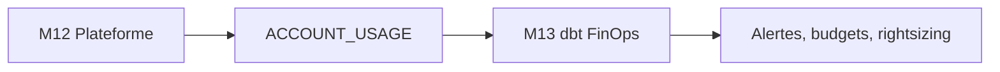

# Cours M13 — Observabilité et FinOps as Code

> [<- Jour 4](../README.md) · [<- Module precedent](../module-12-capstone/lab.md) · **Module 13** · [Module suivant ->](../module-14-data-products/lab.md)

## Pourquoi cette capacité existe

FinOps rend la consommation Snowflake visible, attribuable et actionnable. Terraform prévient les excès avec quotas et auto-suspend ; dbt transforme `ACCOUNT_USAGE` en décisions opérationnelles testées.

## Position dans l'architecture



| Référentiel | Alignement |
|---|---|
| Pattern | Metadata-Driven Observability |
| WAF | Optimisation des coûts, Excellence opérationnelle |
| CAF | Manage |
| Platform Engineering | Mesures et garde-fous as code |

## Modèle de données

La couche staging stabilise quatre sources Snowflake. Les marts répondent à cinq décisions : crédits journaliers, risque des monitors, warehouses inactifs, requêtes coûteuses et tendance du stockage.

## Boucle de contrôle

```text
Mesurer → Attribuer → Comparer au budget → Alerter → Corriger → Vérifier
```

Les Resource Monitors constituent le contrôle immédiat. Les marts dbt expliquent la tendance et la cause.

## Training versus Production

| Dimension | Training | Production |
|---|---|---|
| Accès | Rôle administrateur de sandbox | Rôle de gouvernance dédié |
| Identité | Profil local | JWT depuis Key Vault |
| Fréquence | À la demande | Build planifié et supervisé |
| Restitution | `dbt show` | Dashboard, alertes, ownership |

## Synthèse

Une plateforme observable produit des métriques versionnées, testées, attribuées et reliées à des actions ; elle ne se limite pas à collecter des logs.

---

## Navigation

[<- Course M12](../module-12-capstone/course.md) · [<- Jour 4](../README.md) · **Course M13** · [Course M14 ->](../module-14-data-products/course.md)

