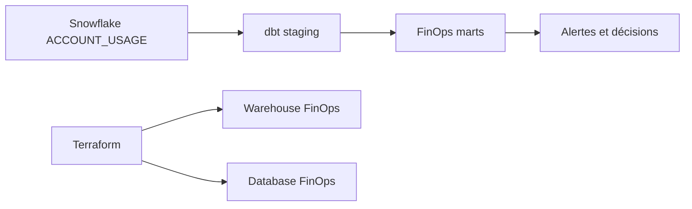

# 🧪 Lab M13 — Observabilité et FinOps as Code avec dbt

> [<- Jour 4](../README.md) · [<- Module precedent](../module-12-capstone/lab.md) · **Module 13** · [Module suivant ->](../module-14-data-products/lab.md)

|| Élément | Valeur |
||---|---|
|| **Durée** | 90 min |
|| **Piste** | `[EXTENSION]` |
|| **Workspace** | `$HOME/Data2AI-Labs/data-platform` (le clone) |
|| **Dossier de travail** | `labs/m13-finops-observability/` |
|| **Coût** | Warehouse FinOps X-SMALL |
|| **Cleanup** | `terraform destroy -auto-approve` à la fin |

> `[IMPORTANT]` Avant de commencer, vous devez etre dans la racine du clone
> et avoir execute `Learner-Login.ps1` dans **cette session** :
>
> ```powershell
> cd "$HOME\Data2AI-Labs\data-platform"
> .\scripts\Learner-Login.ps1 -LearnerPrefix APP01
> ```
>
> Cela set `TF_VAR_snowflake_token` (depuis `secrets/snowflake_pat.txt`)
> et les variables `ARM_*` pour Terraform.
>
> Ensuite, réinitialisez le lab pour partir d'un état propre :
>
> ```powershell
> .\scripts\Reset-Lab.ps1 -LearnerPrefix APP01 -Lab M13
> ```
>
> Puis placez-vous dans le dossier du lab et vérifiez que tout est pret :
>
> ```powershell
> cd "$HOME\Data2AI-Labs\data-platform\labs\m13-finops-observability"
> ..\..\scripts\Test-TerraformReady.ps1
> ```
>
> Si le pre-flight affiche `READY`, lancez `terraform plan -out "m13.tfplan"`.
> Sinon, suivez les corrections indiquees.

## 🎯 1. Mission Métier & User Story

Le propriétaire de la plateforme doit attribuer les crédits consommés, détecter les warehouses inactifs et prévenir un dépassement avant la facture. Vous allez configurer dbt avec le package `get-select/dbt_snowflake_monitoring` pour transformer la télémétrie Snowflake en indicateurs de décision.

> **En tant que :** FinOps Engineer  
> **Je veux :** configurer dbt avec `dbt_snowflake_monitoring` pour suivre les crédits et détecter les warehouses inactifs  
> **Afin de :** prévenir les dépassements budgétaires avant la facture

---

## 🏗️ 2. Architecture & Modèle Mental



## 🎯 3. Objectifs Pédagogiques Vérifiables

- configurer un projet dbt avec le package `dbt_snowflake_monitoring` 4.6.0;
- expliquer la latence de 1 à 3 heures des vues `ACCOUNT_USAGE`;
- construire et tester les modèles FinOps;
- interpréter crédits, requêtes coûteuses et warehouses inactifs.

## � 4. Pre-Flight Diagnostic (Vérification Initiale)

### Prérequis

- [ ] dbt installé (vérifié au Jour 0);
- [ ] `dbt --version` affiche une version < 3.0.0;
- [ ] accès au schema `SNOWFLAKE.ACCOUNT_USAGE` (rôle `ACCOUNTADMIN` ou équivalent).
- [ ] Le dossier `labs/m13-finops-observability/` contient `provider.tf`, `versions.tf`, `variables.tf` et `terraform.tfvars.example` (fournis).

## 📝 5. Étapes d'Implémentation Pas-à-Pas (80% Hands-On)

### 📝 Étape 5.1 — Créer l'infrastructure FinOps avec Terraform

#### Créer la database et le warehouse FinOps

Ce lab est autonome : il crée sa propre database FinOps et son warehouse avec Terraform.

Éditez `labs/m13-finops-observability/main.tf` :

```hcl
# ------------------------------------------------------------------
# FinOps database
# ------------------------------------------------------------------

resource "snowflake_database" "finops" {
  name    = "${var.learner_prefix}_M13_FINOPS_${var.environment}"
  comment = "FinOps monitoring database for ${var.learner_prefix} M13"
}

# ------------------------------------------------------------------
# FinOps warehouse
# ------------------------------------------------------------------

resource "snowflake_warehouse" "finops" {
  name                = "WH_${var.learner_prefix}_M13_FINOPS_${var.environment}"
  warehouse_size      = "X-SMALL"
  auto_suspend        = 60
  auto_resume         = true
  initially_suspended = true
  comment             = "FinOps warehouse for ${var.learner_prefix} M13"
}
```

#### Ajouter les outputs dans `outputs.tf`

```hcl
output "finops_database" {
  value = snowflake_database.finops.name
}

output "finops_warehouse" {
  value = snowflake_warehouse.finops.name
}
```

#### Planifier et appliquer

```bash
cd labs/m13-finops-observability
terraform fmt
terraform init
terraform validate
terraform plan -out "m13.tfplan"
terraform apply "m13.tfplan"
```

✅ **Checkpoint** : la database `APP01_M13_FINOPS_DEV` et le warehouse `WH_APP01_M13_FINOPS_DEV` sont créés.

### 📝 Étape 5.2 — Créer le projet dbt FinOps

#### Créer la structure dbt

```bash
cd $HOME/Data2AI-Labs/data-platform/labs/m13-finops-observability
mkdir -p finops/models/staging finops/models/marts
```

#### Créer `finops/dbt_project.yml`

```yaml
name: finops
version: 1.0.0
profile: finops

models:
  finops:
    staging:
      +materialized: view
      +schema: staging
    marts:
      +materialized: table
      +schema: marts
```

#### Créer `finops/packages.yml`

```yaml
packages:
  - package: get-select/dbt_snowflake_monitoring
    version: 4.6.0
  - package: dbt-labs/dbt_utils
    version: 1.3.3
```

#### Créer `finops/profiles.yml.example`

```yaml
finops:
  target: dev
  outputs:
    dev:
      type: snowflake
      account: ZVFXOZW-PM71247
      user: DATA2AI
      role: ACCOUNTADMIN
      database: APP01_M13_FINOPS_DEV
      warehouse: WH_APP01_M13_FINOPS_DEV
      schema: PUBLIC
      authenticator: snowflake
      private_key_path: "{{ env_var('SNOWFLAKE_PRIVATE_KEY_FILE') }}"
```

> 🔒 **SECURITY** Copiez ce fichier vers `~/.dbt/profiles.yml` et remplacez les valeurs localement. Ne commitez jamais `profiles.yml` avec des secrets.

#### Créer le profil local

```bash
cp finops/profiles.yml.example ~/.dbt/profiles.yml
```

Éditez `~/.dbt/profiles.yml` avec vos valeurs réelles.

#### Installer les dépendances

```bash
cd finops
dbt deps
```

✅ **Checkpoint** : les packages `dbt_snowflake_monitoring` 4.6.0 et `dbt_utils` 1.3.3 sont installés.

#### Tester la connexion

```bash
dbt debug --target dev
```

✅ **Checkpoint** : `All checks passed!`

### 📝 Étape 5.3 — Construire la couche FinOps

#### Construire les modèles

```bash
dbt build --target dev
```

✅ **Checkpoint** : les modèles du package `dbt_snowflake_monitoring` sont construits sans erreur.

> Si vous obtenez `insufficient privileges`, vérifiez que votre rôle a accès à `SNOWFLAKE.ACCOUNT_USAGE`.

### 📝 Étape 5.4 — Interpréter les indicateurs

#### Crédits par warehouse

```bash
dbt show --select snowflake_monitoring.mart_warehouse_credits_daily --limit 10
```

✅ **Checkpoint** : une table avec les crédits consommés par warehouse et par jour.

#### Warehouses inactifs

```bash
dbt show --select snowflake_monitoring.mart_warehouse_credits_daily --limit 10
```

Identifiez les warehouses avec 0 crédits sur les derniers jours.

#### Requêtes coûteuses

```bash
dbt show --select snowflake_monitoring.mart_query_history --limit 10
```

✅ **Checkpoint** : les requêtes triées par coût.

#### Vérifier dans Snowflake

```sql
SELECT * FROM APP01_M13_FINOPS_DEV.MARTS.MART_WAREHOUSE_CREDITS_DAILY ORDER BY USAGE_DATE DESC LIMIT 10;
SELECT * FROM APP01_M13_FINOPS_DEV.MARTS.MART_RESOURCE_MONITOR_RISK WHERE RISK_STATUS IN ('WARNING', 'CRITICAL');
```

### 📝 Étape 5.5 — Relier contrôle préventif et observation

#### Vérifier les Resource Monitors

```bash
snow sql -c training -q "SHOW RESOURCE MONITORS"
```

#### Vérifier les tags

```bash
snow sql -c training -q "SELECT * FROM APP01_M13_FINOPS_DEV.INFORMATION_SCHEMA.TAG_REFERENCES"
```

#### Attribuer les coûts

Les marts FinOps permettent d'attribuer les coûts par :

- warehouse (compute);
- database (storage);
- rôle (attribution métier);
- environnement (DEV, UAT, PROD).

#### Inspection des Resource Monitors & Cost Management dans Snowsight UI

1. Connectez-vous à **Snowflake Snowsight (`app.snowflake.com`)** avec le rôle `ACCOUNTADMIN` ou `SYSADMIN`.
2. Naviguez vers **Admin > Cost Management**.
3. Cliquez sur l'onglet **Resource Monitors** :
   - Constatez la présence du moniteur rattaché à votre warehouse d'atelier.
   - Inspectez la jauge de crédit mensuelle et les seuils d'alerte configurés (ex: 80% Notification, 100% Suspension stricte).
4. Naviguez vers l'onglet **Consumption** et observez les graphiques de consommation horaire et par entrepôt virtuel.

---

## 🐛 6. Incident Contrôlé (*Chaos Engineering Lab*)

*Dans ce Chaos Lab, vous allez simuler un dépassement de quota budgétaire pour observer le blocage immédiat imposé par le Resource Monitor de Snowflake.*

### Symptôme & Injection

Modifiez temporairement le quota du Resource Monitor pour lui assigner un seuil inférieur à la consommation actuelle :

```sql
ALTER RESOURCE MONITOR RM_APP01_M13_DEV SET CREDIT_QUOTA = 1;
```

Tentez de démarrer le warehouse pour exécuter une requête lourde :

```sql
ALTER WAREHOUSE WH_APP01_M13_FINOPS_DEV RESUME;
```

Observez l'erreur immédiate renvoyée par Snowflake :

```text
000670 (57014): Warehouse cannot be resumed because resource monitor quota has been exceeded.
```

### Diagnostic & Observation

Dans **Snowsight UI > Admin > Cost Management > Resource Monitors**, le moniteur apparaît avec un statut d'alerte rouge `Suspended (100% reached)`.

### Remédiation

Rétablissez le quota nominal avec Terraform :

```bash
terraform apply
```

Le warehouse redevient immédiatement disponible pour l'ingestion et les transformations.

---

## 🤖 7. Validation Automatisée (*Check My Progress*)

Validez la configuration FinOps et dbt avec le runner de formation :

```powershell
.\scripts\SelfPacedLab.ps1 -Module 13 -All -Report
```

<details>
<summary>✅ <b>Sortie attendue du validateur</b></summary>

```text
[PASS] T1 snowflake_resource_monitor resource declared
[PASS] T2 Credit quota threshold set
[PASS] T3 Resource monitor attached to warehouse
[PASS] T4 terraform fmt & validate
[PASS] T5 Plan evidence
Result: 5/5 Tasks Passed.
```
</details>

---

## 🏆 8. Défi Autonome (*Unguided Challenge*)

> **Scénario :** Créez un mart personnalisé `mart_cost_by_environment` qui agrège les crédits par environnement en utilisant le préfixe du nom de warehouse.
> **Contraintes :**
> - `dbt build` réussit;
> - le mart contient une ligne par environnement;
> - les coûts sont agrégés correctement.

| Critère d'Évaluation | Points |
|---|---:|
| Syntaxe HCL et respect des standards | 30 pts |
| Preuve d'exécution fonctionnelle | 30 pts |
| Idempotence (`0 to add, 0 to change, 0 to destroy`) | 20 pts |
| Respect des budgets FinOps & Sécurité | 20 pts |
| **Total** | **100 pts** |

## 🧹 9. Nettoyage Contrôlé (*FinOps Teardown*)

Détruisez toutes les ressources créées dans ce lab :

```bash
cd labs/m13-finops-observability
terraform destroy -auto-approve
```

> Vous pouvez aussi utiliser `.\scripts\Reset-Lab.ps1 -LearnerPrefix APP01 -Lab M13` depuis la racine du clone pour nettoyer automatiquement.

---

## Navigation

[<- Lab M12](../module-12-capstone/lab.md) · [<- Jour 4](../README.md) · **Lab M13** · [Lab M14 ->](../module-14-data-products/lab.md)
