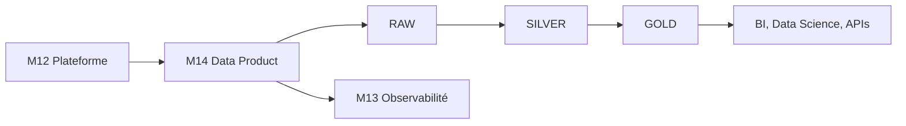

# Cours M14 — Data Products as Code

> [<- Jour 4](../README.md) · [<- Module precedent](../module-13-finops-observability/lab.md) · **Module 14** · [Fin ->](../../README.md)

## Pourquoi cette capacité existe

Un Data Product transforme des données de domaine en un service découvrable, gouverné et exploitable. La plateforme fournit les rails ; le domaine possède le contenu, la qualité et le cycle de vie.

## Position dans l'architecture

| Référentiel | Alignement |
|---|---|
| Patterns | Data Product, Data Mesh, Medallion |
| WAF | Les cinq piliers |
| CAF | Adopt puis Manage |
| Platform Engineering | Golden path de domaine |

## Frontière de responsabilité

| Terraform | Snow CLI |
|---|---|
| Database, schemas, stage | Tables, vues et logique SQL |
| Rôles et Future Grants | Migrations de contenu |
| Contrat structurel | Contrat de données |
| Plan et state | Historique SQL et tests |

## Medallion

- **RAW :** données reçues, traçables et peu transformées.
- **SILVER :** données validées, normalisées et dédupliquées.
- **GOLD :** vues et agrégats contractuels destinés aux consommateurs.

## Data Mesh

L'autonomie n'est pas l'absence de gouvernance. Les modules, conventions, CI/CD, identités, budgets et observabilité sont fédérés ; l'ownership des produits reste dans les domaines.

## Training versus Production

| Dimension | Training | Production |
|---|---|---|
| Ingestion | Stage interne | Azure Storage Integration gouvernée |
| Catalogue | Map Terraform | Portail self-service et catalogue |
| Contrat | SQL simple | Version, compatibilité et data quality SLO |
| Promotion | Commandes guidées | Pipeline signé avec approbations |

## Synthèse

Le Golden Path produit un environnement de domaine complet avec un appel de module puis publie le contenu SQL sans confondre les cycles de vie.

---

## Navigation

[<- Course M13](../module-13-finops-observability/course.md) · [<- Jour 4](../README.md) · **Course M14** · [Fin de formation ->](../../README.md)

