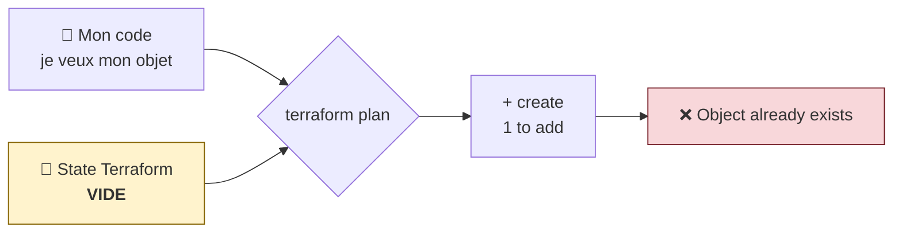

# 🏦 Atelier GlobalBank — Jour 1

## *Du clic au code : ma première ressource Terraform*

> **Parcours :** Industrialisation d'une Data Platform · **Jour 1**
> **Durée :** 5 h · **Prérequis Terraform : aucun**
> **Outils :** navigateur (Snowsight) + VS Code. **Aucun script, aucun PowerShell.**

---

## 1. Le contexte

GlobalBank migre son datawarehouse vers Snowflake. Votre prédécesseur a tout construit **à la main**. L'Inspection Générale demande maintenant qui a créé quoi, quand, et pourquoi. Personne ne peut répondre.

**Mission de la semaine :** reconstruire la plateforme **en tant que code**.

### Les 4 équipes

Chaque équipe est responsable de son propre périmètre. **Vous ne créez que les objets de votre rôle.**

| Équipe | Commanditaire | Son rôle dans la plateforme | Ce qu'elle crée aujourd'hui |
|---|---|---|---|
| 🏛️ **Platform** | Sofia Almeida | Les zones de données, la gouvernance | Une **database** |
| ⚙️ **Data Engineering** | Marc Lefèvre | L'ingestion des fichiers, la zone RAW | Un **warehouse** `INGEST` |
| 💼 **Business Developer** | Wei Chen | Les data products, Customer 360, scoring | Un **warehouse** `DS` |
| 📊 **BI** | Nadia Ben Salah | Les dashboards, le reporting agences | Un **warehouse** `BI` |

> 🧠 **Personne ne crée l'objet d'une autre équipe.** C'est déjà de la séparation des responsabilités — exactement ce que l'auditrice cherche.

### Votre `learner_prefix`

Vous partagez tous **le même compte Snowflake**. Chaque apprenant reçoit un **préfixe personnel** qui isole ses objets.

```
   <LEARNER_PREFIX>_<OBJET>

   APP01  →  APP01_GLOBALBANK_RAW
   APP07  →  APP07_DS_WH            ← même code, préfixe différent
```

**Notez votre `learner_prefix` :** `______________`  *(attribué par le formateur : `APP01` à `APP11`)*

---

## 2. À la fin du Jour 1, vous saurez

- ✅ créer votre ressource dans Snowsight, et lire le SQL qu'elle a réellement généré ;
- ✅ retrouver chaque champ du formulaire dans un fichier `.tf` ;
- ✅ expliquer à quoi servent `provider.tf` et `main.tf` ;
- ✅ dérouler `init → plan → apply` et lire un plan ;
- ✅ dire ce que Terraform sait faire que le formulaire ne sait pas.

---

## 3. Le poste de travail — 15 minutes, une seule fois

| # | Action | Où |
|:---:|---|---|
| 1 | Installer **VS Code** + l'extension **HashiCorp Terraform** | marketplace VS Code |
| 2 | Vérifier **Terraform** | `terraform version` |
| 3 | Créer votre dossier de travail | `globalbank/<votre-équipe>/` |
| 4 | Générer un jeton Snowflake | Snowsight → avatar → *Settings → Authentication* |
| 5 | Déposer `.vscode/tasks.json` | fourni par le formateur |

> ⚠️ **Le jeton ne s'affiche qu'une fois.** Copiez-le immédiatement.

### Les commandes au clic

**`Ctrl+Shift+B`** dans VS Code :

```
   ▸ 1 · Formater        ▸ 2 · Initialiser      ▸ 3 · Vérifier
   ▸ 4 · Prévisualiser   ▸ 5 · Appliquer        ▸ 9 · Supprimer
```

> 💡 Vous ne taperez **aucune commande** de la journée.

---
---

# PARTIE A — 🖱️ La démonstration

> **Le formateur fait cette partie au vidéoprojecteur. Vous regardez.**
> Vous ferez la même chose sur **votre** objet en Partie C.

---

## 4. Le ticket de Marc Lefèvre

```
   ┌──────────────────────────────────────────────────────────────┐
   │  De : Marc Lefèvre — Data Engineering                        │
   │  Le : lundi 6 septembre, 08 h 42                             │
   │                                                              │
   │  « Le fichier de transactions arrive chaque nuit à 03 h 00   │
   │    et doit être chargé avant l'ouverture des agences à       │
   │    06 h 00. J'ai besoin d'un warehouse dédié : quand Thomas  │
   │    lance ses calculs de risque, mes chargements passent de   │
   │    12 à 50 minutes.                                          │
   │    Attention au budget — la facture a pris 38 % ce           │
   │    trimestre. »                                              │
   └──────────────────────────────────────────────────────────────┘
```

## 4.1 Le formulaire Snowsight

**Admin → Warehouses → `+ Warehouse`**

> 📷 **[CAPTURE]** Liste des warehouses — voir `usecase/screenshots/MANIFEST.md`

```
   ┌─ Create Warehouse ──────────────────────────────────┐
   │   Name        [ APP04_INGEST_WH             ] ──── ①
   │   Size        [ X-Small                 ▾   ] ──── ②
   │   Comment     [ Data Engineering — ingestion] ──── ③
   │                                                     │
   │   ▾ Advanced Options                                │
   │     Auto Resume    ☑                          ──── ④
   │     Auto Suspend   ☑   [ 1 ]  minutes         ──── ⑤
   │                                                     │
   │                        [ Cancel ]   [ Create ]      │
   └─────────────────────────────────────────────────────┘
```

> 📷 **[CAPTURE]** Formulaire rempli — voir `usecase/screenshots/MANIFEST.md`

> 💰 **Le champ ② vaut de l'argent.** Un X-Small consomme 1 crédit par heure, un X-Large en consomme 16. Le `DS_WH` du design cible, en X-Large laissé actif en continu, coûterait **34 560 $ par mois**. En formation, tout le monde reste en **X-Small**.
>
> 💰 **Le champ ⑤ aussi.** Sans `Auto Suspend`, le warehouse tourne — et facture — 24 h sur 24.

## 4.2 🔍 Ce que Snowflake a vraiment fait

Le formulaire n'est qu'une **façade au-dessus d'une commande SQL**.

**Projects → Worksheets → `+`**

```sql
SELECT GET_DDL('WAREHOUSE', 'APP04_INGEST_WH');
```

```sql
create or replace warehouse APP04_INGEST_WH
    warehouse_size = 'XSMALL'
    auto_suspend = 60
    auto_resume = true
    comment = 'Data Engineering — ingestion quotidienne';
```

> 🧠 **Le déclic.** On a coché « Auto Suspend — **1 minute** ». Snowflake a écrit `auto_suspend = **60**`. Le formulaire affiche des **minutes**, Snowflake stocke des **secondes**.

## 4.3 🔁 La table de correspondance

**C'est le cœur de la méthode.** Chaque champ a son équivalent exact.

| # | Champ Snowsight | Saisi | SQL généré | Argument Terraform |
|:---:|---|---|---|---|
| ① | **Name** | `APP04_INGEST_WH` | `create warehouse APP04_INGEST_WH` | `name = "${var.learner_prefix}_INGEST_WH"` |
| ② | **Size** | `X-Small` | `warehouse_size = 'XSMALL'` | `warehouse_size = "X-SMALL"` |
| ③ | **Comment** | `Data Engineering — …` | `comment = '…'` | `comment = "Data Engineering — …"` |
| ④ | **Auto Resume** ☑ | activé | `auto_resume = true` | `auto_resume = true` |
| ⑤ | **Auto Suspend** ☑ | `1 minute` | `auto_suspend = 60` | `auto_suspend = 60` |
| — | *(absent du formulaire)* | — | — | `initially_suspended = true` 💰 |

> 🧠 **La dernière ligne est la plus importante de la journée.**
> `initially_suspended` **n'existe dans aucun écran de Snowsight**. Terraform crée le warehouse **déjà éteint** — zéro crédit consommé à la création.
>
> **Terraform ne se contente pas de reproduire le formulaire. Il va plus loin.**

---
---

# PARTIE B — ⌨️ La structure de projet

> Cette partie est **identique pour les 4 équipes**. Faites-la tous ensemble.

---

## 5. Trois fichiers, pas un de plus

```
   globalbank/<votre-équipe>/
   ├── provider.tf              ← à qui je parle + mes variables
   ├── main.tf                  ← ce que je veux
   ├── terraform.tfvars         ← mes valeurs   ⛔ jamais dans Git
   ├── .gitignore
   └── .vscode/tasks.json
```

> 🧠 **Terraform ne connaît pas le nom de vos fichiers.** Il lit **tous** les `.tf` du dossier et les additionne. Le découpage est une convention pour les humains.

## 5.1 `provider.tf` — identique pour tout le monde

```hcl
terraform {
  required_version = "= 1.14.5"

  required_providers {
    snowflake = {
      source  = "snowflakedb/snowflake"
      version = "= 2.14.0"
    }
  }
}

variable "snowflake_organization" { type = string }
variable "snowflake_account" { type = string }
variable "snowflake_user" { type = string }

variable "snowflake_token" {
  type        = string
  sensitive   = true
  description = "PAT — lu depuis secrets/, ne rien mettre ici"
  default     = ""
}

variable "learner_prefix" {
  type        = string
  description = "Préfixe personnel — isole vos objets dans le compte partagé"

  validation {
    condition     = can(regex("^[A-Z0-9_]{2,12}$", var.learner_prefix))
    error_message = "learner_prefix must be 2-12 uppercase alphanumeric characters or underscore."
  }
}

locals {
  pat_file        = "${path.module}/../../../../../secrets/snowflake_pat.txt"
  snowflake_token = try(trimspace(file(local.pat_file)), var.snowflake_token, "")
}

provider "snowflake" {
  organization_name = var.snowflake_organization
  account_name      = var.snowflake_account
  user              = var.snowflake_user
  authenticator     = "PROGRAMMATIC_ACCESS_TOKEN"
  token             = local.snowflake_token

  preview_features_enabled = ["snowflake_table_resource"]
}
```

> 🧠 **Deux blocs, deux rôles.**
> `terraform { }` = **le contrat** — quelle version, quel plugin. Ne change presque jamais.
> `provider "snowflake" { }` = **le badge d'accès** — quel compte, quelle identité.
>
> 🔒 `sensitive = true` masque le jeton dans toutes les sorties.
>
> 🔑 Le jeton est lu depuis `secrets/snowflake_pat.txt` — **jamais** dans `terraform.tfvars`.

## 5.2 `terraform.tfvars` — la seule ligne qui vous distingue

```hcl
snowflake_organization = "ZVFXOZW"
snowflake_account      = "PM71247"
snowflake_user         = "DATA2AI"

learner_prefix = "APP04" # ← REMPLACEZ par le vôtre
```

> 🎯 Le suffixe `.auto.tfvars` est chargé **automatiquement**. Ce fichier est dans `.gitignore`.
> **Aucun mot de passe / token ne va ici.**

## 5.3 Anatomie d'un bloc `resource`

```
   resource   "snowflake_warehouse"   "ingest"   {
      ▲                ▲                  ▲
      │                │                  └── 3. NOM LOCAL — vous le choisissez.
      │                │                       Interne à Terraform.
      │                │                       N'existe PAS dans Snowflake.
      │                └── 2. TYPE — imposé par le provider.
      │                     Le préfixe « snowflake_ » désigne le plugin.
      └── 1. MOT-CLÉ Terraform

   ➡️  Le nom RÉEL dans Snowflake est la valeur de l'argument « name ».
```

> ❓ **« `"ingest"`, c'est le nom du warehouse ? »** Non. C'est un libellé interne, comme un nom de variable. Vous pourriez écrire `"pizza"` — Snowflake créerait toujours `APP04_INGEST_WH`.

> 🧠 **`"${var.learner_prefix}_INGEST_WH"` — l'interpolation.** Les `${...}` insèrent la valeur d'une variable dans une chaîne. C'est ce qui rend votre code **identique** à celui de vos collègues.

## 5.4 `.gitignore`

```gitignore
*.tfvars
!*.tfvars.example
.terraform/
terraform.tfstate
terraform.tfstate.backup
*.tfplan
```

---
---

# PARTIE C — 🎯 À vous !

> ## 👉 Dépliez **uniquement le bloc de votre équipe**.
> Chaque bloc contient votre ticket, vos valeurs Snowsight, votre SQL, votre table de correspondance et votre `main.tf`.
> **Remplacez `APP0X` par VOTRE `learner_prefix` partout.**

---

<details>
<summary><b>🏛️ ÉQUIPE PLATFORM — la zone RAW</b></summary>

<br/>

### 📩 Votre ticket

```
   ┌──────────────────────────────────────────────────────────────┐
   │  De : Sofia Almeida — Head of Data Platform                  │
   │                                                              │
   │  « Avant que quiconque charge quoi que ce soit, il nous      │
   │    faut la zone d'atterrissage. C'est la fondation :         │
   │    aucune équipe ne peut travailler sans elle.               │
   │                                                              │
   │    Rétention Time Travel à 1 jour en formation — en          │
   │    production ce sera 30, et c'est du stockage facturé. »    │
   └──────────────────────────────────────────────────────────────┘
```

### 🖱️ Étape 1 — Dans Snowsight

**Data → Databases → `+ Database`**

```
   ┌─ Create Database ───────────────────────────────────┐
   │   Name        [ APP0X_GLOBALBANK_RAW        ] ──── ①
   │   Comment     [ Zone RAW — données brutes   ] ──── ②
   │                        [ Cancel ]   [ Create ]      │
   └─────────────────────────────────────────────────────┘
```

| Champ | Valeur à saisir |
|---|---|
| **Name** | `APP0X_GLOBALBANK_RAW` |
| **Comment** | `Zone RAW — données brutes` |

✅ La database apparaît dans **Data → Databases**.

### 🔍 Étape 2 — Le SQL généré

```sql
SELECT GET_DDL('DATABASE', 'APP0X_GLOBALBANK_RAW');
```

```sql
create or replace database APP0X_GLOBALBANK_RAW
    comment = 'Zone RAW — données brutes';
```

> 🧠 **Deux champs seulement, et pourtant :** la rétention Time Travel n'apparaît nulle part — Snowflake a appliqué la valeur par défaut du compte **sans vous le dire**. Terraform, lui, l'écrira explicitement. C'est déjà un gain d'auditabilité.
>
> Vérifiez la valeur réellement appliquée :
> ```sql
> SHOW DATABASES LIKE 'APP0X_GLOBALBANK_RAW';
> ```

### 🔁 Étape 3 — Votre table de correspondance

| # | Champ Snowsight | Saisi | SQL généré | Argument Terraform |
|:---:|---|---|---|---|
| ① | **Name** | `APP0X_GLOBALBANK_RAW` | `create database APP0X_GLOBALBANK_RAW` | `name = "${var.learner_prefix}_GLOBALBANK_RAW"` |
| ② | **Comment** | `Zone RAW — …` | `comment = '…'` | `comment = "Zone RAW — données brutes"` |
| — | *(absent du formulaire)* | — | *(défaut du compte)* | `data_retention_time_in_days = 1` 💰 |

### ⌨️ Étape 4 — Votre `main.tf`

```hcl
resource "snowflake_database" "raw" {
  name                        = "${var.learner_prefix}_GLOBALBANK_RAW"
  comment                     = "Zone RAW — données brutes"
  data_retention_time_in_days = 1
}
```

### ✅ Votre preuve

| # | Attendu |
|:---:|---|
| 1 | La database existe dans **Data → Databases** |
| 2 | `GET_DDL` lu en worksheet |
| 3 | `Apply complete! Resources: 1 added` |
| 4 | Second plan → `No changes.` |
| 5 | `SHOW DATABASES` affiche une rétention de 1 jour |

> 🎯 **Votre rôle a une conséquence :** les autres équipes poseront leurs schemas dans une zone comme la vôtre demain. **Vous êtes la fondation.** Ne la détruisez pas ce soir.

</details>

---

<details>
<summary><b>⚙️ ÉQUIPE DATA ENGINEERING — le warehouse d'ingestion</b></summary>

<br/>

### 📩 Votre ticket

```
   ┌──────────────────────────────────────────────────────────────┐
   │  De : Marc Lefèvre — Data Engineering                        │
   │                                                              │
   │  « Le fichier de transactions arrive à 03 h 00 et doit être  │
   │    chargé avant 06 h 00. J'ai besoin d'un warehouse dédié :  │
   │    quand Thomas lance ses calculs de risque, mes             │
   │    chargements passent de 12 à 50 minutes.                   │
   │    Attention au budget. »                                    │
   └──────────────────────────────────────────────────────────────┘
```

### 🖱️ Étape 1 — Dans Snowsight

**Admin → Warehouses → `+ Warehouse`**

| Champ | Valeur à saisir |
|---|---|
| **Name** | `APP0X_INGEST_WH` |
| **Size** | `X-Small` |
| **Comment** | `Data Engineering — ingestion quotidienne` |
| **Auto Resume** | ☑ activé |
| **Auto Suspend** | ☑ `1` minute |

✅ Le warehouse apparaît dans **Admin → Warehouses**.

### 🔍 Étape 2 — Le SQL généré

```sql
SELECT GET_DDL('WAREHOUSE', 'APP0X_INGEST_WH');
```

```sql
create or replace warehouse APP0X_INGEST_WH
    warehouse_size = 'XSMALL'
    auto_suspend = 60
    auto_resume = true
    comment = 'Data Engineering — ingestion quotidienne';
```

> 🧠 **1 minute cochée → `auto_suspend = 60`.** Minutes affichées, secondes stockées.

### 🔁 Étape 3 — Votre table de correspondance

| # | Champ Snowsight | Saisi | SQL généré | Argument Terraform |
|:---:|---|---|---|---|
| ① | **Name** | `APP0X_INGEST_WH` | `create warehouse APP0X_INGEST_WH` | `name = "${var.learner_prefix}_INGEST_WH"` |
| ② | **Size** | `X-Small` | `warehouse_size = 'XSMALL'` | `warehouse_size = "X-SMALL"` |
| ③ | **Comment** | `Data Engineering — …` | `comment = '…'` | `comment = "Data Engineering — ingestion quotidienne"` |
| ④ | **Auto Resume** ☑ | activé | `auto_resume = true` | `auto_resume = true` |
| ⑤ | **Auto Suspend** ☑ | `1 minute` | `auto_suspend = 60` | `auto_suspend = 60` |
| — | *(absent du formulaire)* | — | — | `initially_suspended = true` 💰 |

### ⌨️ Étape 4 — Votre `main.tf`

```hcl
resource "snowflake_warehouse" "ingest" {
  name                = "${var.learner_prefix}_INGEST_WH"
  warehouse_size      = "X-SMALL"
  comment             = "Data Engineering — ingestion quotidienne"
  auto_resume         = true
  auto_suspend        = 60
  initially_suspended = true
}
```

### ✅ Votre preuve

| # | Attendu |
|:---:|---|
| 1 | Le warehouse existe dans **Admin → Warehouses** |
| 2 | `GET_DDL` lu, `auto_suspend = 60` repéré |
| 3 | `Apply complete! Resources: 1 added` |
| 4 | Second plan → `No changes.` |
| 5 | Statut **`Suspended`** — preuve de `initially_suspended` |

> 💰 **`auto_suspend = 60` est le plus agressif des quatre équipes.** L'ingestion tourne par rafales nocturnes : entre deux fichiers, chaque seconde active est du gaspillage.

</details>

---

<details>
<summary><b>💼 ÉQUIPE BUSINESS DEVELOPER — le warehouse data science</b></summary>

<br/>

### 📩 Votre ticket

```
   ┌──────────────────────────────────────────────────────────────┐
   │  De : Wei Chen — Data Science & Data Products                │
   │                                                              │
   │  « L'entraînement du modèle de scoring crédit sature dès     │
   │    que quelqu'un d'autre travaille sur le même compute.      │
   │    Il me faut mon propre warehouse, isolé.                   │
   │                                                              │
   │    Mes sessions durent 2 à 3 heures avec des pauses de       │
   │    plusieurs minutes entre deux itérations — ne le coupez    │
   │    pas trop vite, je perds le cache. »                       │
   └──────────────────────────────────────────────────────────────┘
```

### 🖱️ Étape 1 — Dans Snowsight

**Admin → Warehouses → `+ Warehouse`**

| Champ | Valeur à saisir |
|---|---|
| **Name** | `APP0X_DS_WH` |
| **Size** | `X-Small` |
| **Comment** | `BizDev — Customer 360 & scoring crédit` |
| **Auto Resume** | ☑ activé |
| **Auto Suspend** | ☑ `5` minutes |

> 💰 **Pourquoi 5 minutes et non 1 ?** Wei enchaîne des itérations espacées. Un redémarrage à chaque pause vide le cache et rallonge chaque exécution. **Le paramètre suit l'usage réel, pas une règle uniforme.**
>
> 💰 **Le design cible prévoit X-LARGE** pour ce warehouse — 16 crédits/heure, soit **34 560 $/mois** s'il restait actif en continu. En formation, on reste en X-Small.

✅ Le warehouse apparaît dans **Admin → Warehouses**.

### 🔍 Étape 2 — Le SQL généré

```sql
SELECT GET_DDL('WAREHOUSE', 'APP0X_DS_WH');
```

```sql
create or replace warehouse APP0X_DS_WH
    warehouse_size = 'XSMALL'
    auto_suspend = 300
    auto_resume = true
    comment = 'BizDev — Customer 360 & scoring crédit';
```

> 🧠 **5 minutes cochées → `auto_suspend = 300`.** Comparez avec Data Engineering (`60`) : **même champ, même unité, valeur métier différente.**

### 🔁 Étape 3 — Votre table de correspondance

| # | Champ Snowsight | Saisi | SQL généré | Argument Terraform |
|:---:|---|---|---|---|
| ① | **Name** | `APP0X_DS_WH` | `create warehouse APP0X_DS_WH` | `name = "${var.learner_prefix}_DS_WH"` |
| ② | **Size** | `X-Small` | `warehouse_size = 'XSMALL'` | `warehouse_size = "X-SMALL"` |
| ③ | **Comment** | `BizDev — …` | `comment = '…'` | `comment = "BizDev — Customer 360 & scoring crédit"` |
| ④ | **Auto Resume** ☑ | activé | `auto_resume = true` | `auto_resume = true` |
| ⑤ | **Auto Suspend** ☑ | `5 minutes` | `auto_suspend = 300` | `auto_suspend = 300` |
| — | *(absent du formulaire)* | — | — | `initially_suspended = true` 💰 |

### ⌨️ Étape 4 — Votre `main.tf`

```hcl
resource "snowflake_warehouse" "ds" {
  name                = "${var.learner_prefix}_DS_WH"
  warehouse_size      = "X-SMALL"
  comment             = "BizDev — Customer 360 & scoring crédit"
  auto_resume         = true
  auto_suspend        = 300
  initially_suspended = true
}
```

### ✅ Votre preuve

| # | Attendu |
|:---:|---|
| 1 | Le warehouse existe dans **Admin → Warehouses** |
| 2 | `GET_DDL` lu, `auto_suspend = 300` repéré |
| 3 | `Apply complete! Resources: 1 added` |
| 4 | Second plan → `No changes.` |
| 5 | Statut **`Suspended`** |

> 🎯 **Comparez votre `main.tf` avec celui de Data Engineering.** Deux lignes diffèrent : le nom et `auto_suspend`. **Retenez-le — vendredi, ce constat deviendra un module.**

</details>

---

<details>
<summary><b>📊 ÉQUIPE BI — le warehouse décisionnel</b></summary>

<br/>

### 📩 Votre ticket

```
   ┌──────────────────────────────────────────────────────────────┐
   │  De : Nadia Ben Salah — Business Intelligence                │
   │                                                              │
   │  « Mon dashboard de performance agences est consulté par     │
   │    40 personnes chaque matin entre 8 h et 10 h. Dès que      │
   │    Thomas lance ses calculs de risque, les temps de          │
   │    réponse triplent et je reçois des appels.                 │
   │                                                              │
   │    Il me faut un compute séparé, qui ne s'éteigne pas        │
   │    entre deux requêtes de mes utilisateurs. »                │
   └──────────────────────────────────────────────────────────────┘
```

### 🖱️ Étape 1 — Dans Snowsight

**Admin → Warehouses → `+ Warehouse`**

| Champ | Valeur à saisir |
|---|---|
| **Name** | `APP0X_BI_WH` |
| **Size** | `X-Small` |
| **Comment** | `BI — dashboards performance agences` |
| **Auto Resume** | ☑ activé |
| **Auto Suspend** | ☑ `2` minutes |

> 💰 **Pourquoi 2 minutes ?** Quarante utilisateurs interrogent le dashboard par vagues. Suspendre après 1 minute ferait redémarrer le warehouse en permanence ; attendre 5 minutes gaspillerait entre les vagues. **2 minutes est un arbitrage, pas un défaut.**

✅ Le warehouse apparaît dans **Admin → Warehouses**.

### 🔍 Étape 2 — Le SQL généré

```sql
SELECT GET_DDL('WAREHOUSE', 'APP0X_BI_WH');
```

```sql
create or replace warehouse APP0X_BI_WH
    warehouse_size = 'XSMALL'
    auto_suspend = 120
    auto_resume = true
    comment = 'BI — dashboards performance agences';
```

> 🧠 **2 minutes cochées → `auto_suspend = 120`.** Le formulaire affiche des minutes, Snowflake stocke des secondes.

### 🔁 Étape 3 — Votre table de correspondance

| # | Champ Snowsight | Saisi | SQL généré | Argument Terraform |
|:---:|---|---|---|---|
| ① | **Name** | `APP0X_BI_WH` | `create warehouse APP0X_BI_WH` | `name = "${var.learner_prefix}_BI_WH"` |
| ② | **Size** | `X-Small` | `warehouse_size = 'XSMALL'` | `warehouse_size = "X-SMALL"` |
| ③ | **Comment** | `BI — …` | `comment = '…'` | `comment = "BI — dashboards performance agences"` |
| ④ | **Auto Resume** ☑ | activé | `auto_resume = true` | `auto_resume = true` |
| ⑤ | **Auto Suspend** ☑ | `2 minutes` | `auto_suspend = 120` | `auto_suspend = 120` |
| — | *(absent du formulaire)* | — | — | `initially_suspended = true` 💰 |

### ⌨️ Étape 4 — Votre `main.tf`

```hcl
resource "snowflake_warehouse" "bi" {
  name                = "${var.learner_prefix}_BI_WH"
  warehouse_size      = "X-SMALL"
  comment             = "BI — dashboards performance agences"
  auto_resume         = true
  auto_suspend        = 120
  initially_suspended = true
}
```

### ✅ Votre preuve

| # | Attendu |
|:---:|---|
| 1 | Le warehouse existe dans **Admin → Warehouses** |
| 2 | `GET_DDL` lu, `auto_suspend = 120` repéré |
| 3 | `Apply complete! Resources: 1 added` |
| 4 | Second plan → `No changes.` |
| 5 | Statut **`Suspended`** |

> 🎯 **Le ticket de Nadia est le point de départ de toute l'architecture GlobalBank.** Si un seul warehouse servait tout le monde, ses 40 utilisateurs subiraient les calculs de Thomas. **Séparer le compute, c'est séparer les incidents.**

</details>

---

## 6. 🔎 Le point de convergence — 5 minutes en plénière

Une fois vos quatre blocs terminés, **comparez vos `main.tf` à l'écran**.

| | Platform | Data Eng | BizDev | BI |
|---|---|---|---|---|
| Type de ressource | `snowflake_database` | `snowflake_warehouse` | `snowflake_warehouse` | `snowflake_warehouse` |
| `auto_suspend` | — | `60` | `300` | `120` |
| Lignes de code | 5 | 8 | 8 | 8 |

> 🏆 **Trois équipes ont écrit le même bloc, à deux valeurs près.** Retenez cette observation : c'est exactement le problème que les **modules** résoudront vendredi.
>
> Et les membres d'une même équipe ont écrit un `main.tf` **identique au caractère près** — seule la ligne `learner_prefix` diffère. C'est déjà *« un code, N déploiements »*.

---
---

# PARTIE D — ✅ La preuve

---

## 7. Le problème à résoudre

Vous avez **déjà créé l'objet à la main**. Si vous lancez Terraform maintenant, il veut en créer un **second** du même nom — et Snowflake refuse.



> 🧠 **Le state — le concept clé du jour.** Terraform garde la mémoire de ce qu'il a créé, dans `terraform.tfstate`. Ce fichier est vide : Terraform ignore que votre objet existe, **parce que ce n'est pas lui qui l'a créé**.
>
> | 📜 Le code | 📄 Le state | ☁️ Snowflake |
> |---|---|---|
> | Ce que je veux | Ce que Terraform croit avoir fait | Ce qui existe vraiment |

| Option | Geste | Quand |
|---|---|---|
| **A — supprimer et laisser Terraform recréer** | Drop dans Snowsight, puis `apply` | ✅ **Aujourd'hui** — objet de test |
| **B — adopter l'existant** | `terraform import` | 📅 **Jeudi** — production, données réelles |

## 8. Dérouler le workflow

**Étape 1.** Supprimez votre objet dans Snowsight — `…` → **Drop**.

**Étape 2.** Dans VS Code, `Ctrl+Shift+B` :

| # | Tâche | Ce qu'elle fait | Réseau |
|:---:|---|---|:---:|
| 2 | **Initialiser** | Télécharge le provider | ✅ |
| 3 | **Vérifier** | Syntaxe et types | ❌ |
| 4 | **Prévisualiser** | Compare code / state / Snowflake | ✅ lecture |
| 5 | **Appliquer** | Exécute | ✅ écriture |

**Étape 3.** Lisez le plan.

```text
  # snowflake_warehouse.ingest will be created
  + resource "snowflake_warehouse" "ingest" {
      + auto_suspend        = 60
      + initially_suspended = true
      + name                = "APP04_INGEST_WH"     ← votre préfixe, résolu
      + warehouse_size      = "X-SMALL"
    }

Plan: 1 to add, 0 to change, 0 to destroy.
        ▲          ▲           ▲
        └──────────┴───────────┴── ⚠️ LA LIGNE À LIRE EN PREMIER
```

> 🧠 **Les symboles :** `+` créer · `~` modifier sur place · `-` **détruire** 🔴 · `-/+` **détruire puis recréer** 🔴🔴
> **Aucun `apply` sans avoir lu la dernière ligne.**

**Étape 4.** Appliquez → `Apply complete! Resources: 1 added, 0 changed, 0 destroyed.`

**Étape 5.** Retournez dans Snowsight.

> 📷 **[CAPTURE]** Objet recréé par Terraform — voir `usecase/screenshots/MANIFEST.md`

✅ L'objet est de retour, **identique** — mais cette fois **décrit dans un fichier**.

**Étape 6.** Relancez **4 · Prévisualiser**.

```text
No changes. Your infrastructure matches the configuration.
```

> 🏆 **C'est LA preuve qui compte.** Aucun atelier n'est terminé sans ce `No changes.`

---

## 9. 🧠 Les 4 concepts du jour

| Concept | En une phrase |
|---|---|
| **Déclaratif** | Vous décrivez le **résultat voulu**, pas les étapes. Terraform calcule la différence. |
| **`provider` / `resource`** | Le provider dit *à qui je parle*, la resource dit *ce que je veux*. `type.nom_local` est une adresse interne. |
| **Le state** | La mémoire de Terraform. Ce qu'il n'a pas créé n'existe pas pour lui. |
| **Le workflow** | `init → plan → apply`. Le `plan` est en lecture seule : on le lit **avant** chaque `apply`. |

---

## 10. 🐛 L'incident — la dérive

**Provoquez-la.** Snowsight → votre objet → `…` → **Edit** → changez le *Comment* en `Modifié à la main` → **Save**.

**Détectez-la.** `Ctrl+Shift+B` → **4 · Prévisualiser**

```text
  ~ comment = "Modifié à la main" -> "Data Engineering — ingestion quotidienne"

Plan: 0 to add, 1 to change, 0 to destroy.
```

> 🧠 **Le sens de la flèche :** `"ce que Terraform a TROUVÉ"` → `"ce que le code IMPOSE"`.
> Terraform ne demande pas qui a raison. **Le fichier versionné fait autorité.**

**Corrigez-la.** **5 · Appliquer** → puis **4 · Prévisualiser** → `No changes.`

---

## 11. 🧠 Ce que le formulaire ne sait pas faire

| Question de l'Inspection Générale | 🖱️ Snowsight | ⌨️ Terraform |
|---|---|---|
| Qui a créé cet objet, quand ? | Journal d'audit, si activé | `git log main.tf` |
| Pourquoi ce paramétrage ? | Personne ne sait | La *pull request* et son approbation |
| PROD est-il conforme au design validé ? | Comparer deux écrans à l'œil | `plan` → `No changes.` |
| Recréer la plateforme à l'identique ? | Des heures de clics, avec des oublis | 4 minutes |
| Créer le warehouse **déjà éteint** ? | ❌ Impossible | `initially_suspended = true` |
| Tout supprimer proprement ? | Chercher chaque objet à la main | Tâche **9 · Supprimer** |

---

## 12. 🏆 Le défi — sans guidage

```
   ┌──────────────────────────────────────────────────────────────┐
   │  De : Sofia Almeida — Head of Data Platform                  │
   │  Le : mardi, 15 h 20                                         │
   │                                                              │
   │  « Ajoutez un second objet, utile à votre rôle.              │
   │    Méthode imposée : à la main d'abord, puis en code.        │
   │    Contraintes : plan sans destruction, second plan          │
   │    sans changement. »                                        │
   └──────────────────────────────────────────────────────────────┘
```

<details>
<summary>🏛️ <b>Platform</b></summary>

<br/>

Une seconde database `APP0X_GLOBALBANK_CURATED` — la zone des marts métier.

```hcl
resource "snowflake_database" "curated" {
  name                        = "${var.learner_prefix}_GLOBALBANK_CURATED"
  comment                     = "Zone CURATED — marts métier"
  data_retention_time_in_days = 1
}
```
</details>

<details>
<summary>⚙️ <b>Data Engineering</b></summary>

<br/>

Un schema `TRANSACTIONS` — mais il lui faut une database. **Créez la vôtre d'abord.**

```hcl
resource "snowflake_database" "raw" {
  name    = "${var.learner_prefix}_GLOBALBANK_RAW"
  comment = "Zone RAW"
}

resource "snowflake_schema" "transactions" {
  database = snowflake_database.raw.name
  name     = "TRANSACTIONS"
  comment  = "Domaine Transactions — flux quotidien"
}
```

> 💡 `database = snowflake_database.raw.name` — vous venez de créer une **dépendance**. Terraform créera la database **avant** le schema, tout seul. On y revient demain.
</details>

<details>
<summary>💼 <b>Business Developer</b></summary>

<br/>

Un second warehouse `APP0X_SCORING_WH`, dédié au scoring temps réel — donc **jamais suspendu pendant les heures ouvrées**.

> 💡 Quel `auto_suspend` pour un service temps réel ? Justifiez votre choix devant le groupe.
</details>

<details>
<summary>📊 <b>BI</b></summary>

<br/>

Une database `APP0X_GLOBALBANK_CURATED` et un schema `REPORTING` dedans.

> 💡 Même indice que Data Engineering : référencez la database plutôt que d'écrire son nom en dur.
</details>

**Critères :** plan sans destruction · `No changes.` au second plan · aucun identifiant dans les `.tf`.

---

## 13. ⚠️ Avant de partir — la matière première de jeudi

> 🎯 **Créez un dernier objet dans Snowsight, à la main, et NE le mettez PAS en Terraform.**
>
> **Nom imposé :** `<VOTRE_PRÉFIXE>_LEGACY_<TYPE>` — par exemple `APP05_LEGACY_SCHEMA` ou `APP01_LEGACY_DB`.
>
> C'est le « legs du prédécesseur ». **Jeudi, votre voisin l'importera dans son code Terraform** sans jamais l'avoir créé — exactement ce qui vous attend en entreprise.

**Notez au tableau :** votre préfixe, le nom de votre objet `LEGACY`, et son type.

---

## 14. ✅ Grille de vérification

| # | À vérifier | Où |
|:---:|---|---|
| 1 | Mon objet existe dans Snowsight | Écran Snowsight |
| 2 | J'ai lu le SQL de mon `GET_DDL` | Worksheet |
| 3 | Ma table de correspondance est complète | Mon cahier |
| 4 | `Apply complete!` s'est affiché | Panneau VS Code |
| 5 | Le second plan dit `No changes.` | Panneau VS Code |
| 6 | Aucun jeton dans mes fichiers `.tf` | `Ctrl+Shift+F` |
| 7 | Mes objets portent **mon** préfixe | Écran Snowsight |
| 8 | Mon objet `LEGACY` est créé et noté au tableau | Tableau |

---

## 15. 🃏 Anti-sèche

```hcl
# ── La structure d'un bloc ───────────────────────────────
resource "TYPE" "NOM_LOCAL" {
  argument = valeur
}
#   TYPE       → imposé par le provider  (snowflake_warehouse)
#   NOM_LOCAL  → choisi par vous, interne à Terraform
#   name       → le nom RÉEL dans Snowflake

# ── Les 3 fichiers ───────────────────────────────────────
provider.tf           à qui je parle + mes variables
main.tf               ce que je veux
terraform.tfvars      mes valeurs   ⛔ jamais dans Git

# ── Mon préfixe ──────────────────────────────────────────
variable "learner_prefix" { type = string }    déclaré  → provider.tf
learner_prefix = "APP04"                       valorisé → terraform.tfvars
name = "${var.learner_prefix}_INGEST_WH"       utilisé  → main.tf
```

| Tâche VS Code | Commande | Écrit ? |
|---|---|:---:|
| 1 · Formater | `terraform fmt` | fichiers |
| 2 · Initialiser | `terraform init` | `.terraform/` |
| 3 · Vérifier | `terraform validate` | rien |
| 4 · Prévisualiser | `terraform plan` | rien |
| 5 · Appliquer | `terraform apply` | Snowflake + state |
| 9 · Supprimer | `terraform destroy` | Snowflake + state |

**Symboles du plan :** `+` créer · `~` modifier · `-` détruire 🔴 · `-/+` recréer 🔴🔴

**SQL en worksheet** *(remplacez `APP0X` par votre préfixe)* **:**

```sql
SELECT GET_DDL('WAREHOUSE', 'APP0X_INGEST_WH');
SELECT GET_DDL('DATABASE',  'APP0X_GLOBALBANK_RAW');
SHOW WAREHOUSES LIKE 'APP0X%';
SHOW DATABASES  LIKE 'APP0X%';
```

---

## 16. 🔧 Si ça coince

| Message | Cause | Solution |
|---|---|---|
| `Object already exists` | L'objet créé à la main n'a pas été supprimé | Drop dans Snowsight, ou attendez jeudi (`import`) |
| `Invalid account identifier` | Organisation ou compte erroné | Vérifiez `terraform.tfvars` |
| `token is empty` | Jeton non collé, ou fichier mal nommé | Le fichier doit s'appeler `terraform.tfvars` (PAT lu depuis `secrets/`) |
| `Insufficient privileges` | Rôle sans droit de création | Vérifiez votre rôle actif dans Snowsight |
| Terraform demande une valeur au clavier | Une variable n'a pas de valeur | Complétez `terraform.tfvars` |
| `learner_prefix : 3 à 5 caractères…` | Préfixe mal formé | Majuscules et chiffres, ex. `APP07` |
| Mes objets s'appellent `APP01_…` | `learner_prefix` non modifié | Corrigez `terraform.tfvars`, puis `plan` |
| `Unsupported argument` | Nom d'argument erroné | Comparez avec votre table de correspondance |

---

## 17. 🔮 Demain

Votre code fonctionne. Le préfixe est déjà une variable — mais tout le reste est en dur : `"X-SMALL"`, `60`, `"_INGEST_WH"`. Trois questions restent sans réponse :

- ❓ Comment centraliser la convention de nommage au lieu de la répéter dans chaque bloc ?
- ❓ Comment empêcher quelqu'un de saisir `4X-LARGE` par erreur ?
- ❓ Comment créer **six** schemas sans écrire six blocs ?

**Demain :** `variable`, `locals`, `output`, `for_each` — et la structure passe de 3 à 6 fichiers.

---

*Atelier GlobalBank — Jour 1 · Équipes Platform · Data Engineering · Business Developer · BI*