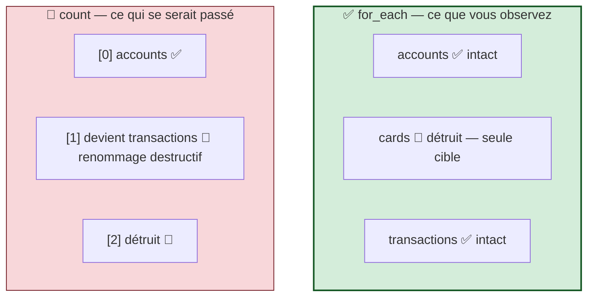

# 🏦 Atelier GlobalBank — Jour 2

## *Ma collection : `locals`, `validation`, `for_each`, `output`*

> **Formation Terraform + provider Snowflake** · ODDO BHF · **Jour 2**
> **Durée :** 4 TP × 1 h · **Prérequis :** Jour 1 terminé, avec `No changes.`
> **Outils :** navigateur (Snowsight) + VS Code

---

## 1. Où nous en sommes

Hier, chacun a créé **un** objet, puis un second en Phase 2. La fondation est posée.

```
   🔵  WH_APP01_INGEST_DEV · WH_APP02_BUSINESS_DEV · WH_APP03_BI_DEV
   🟢  APP04_RAW_DEV (LANDING) · APP05_CORE_DEV (DIM)
   🟠  APP06_CUSTOMER_DEV · APP07_PRODUCT_DEV · APP08_CAMPAIGN_DEV  + schemas
   🟣  APP09_CUSTOMER_MART_DEV · APP10_FINANCE_MART_DEV · APP11_TRANSACTION_MART_DEV  + schemas
```

**Aujourd'hui, chacun remplit son périmètre** — non pas avec un objet, mais avec **une collection**.

```
   ┌──────────────────────────────────────────────────────────────┐
   │  De : Sofia Almeida — Head of Data Platform                  │
   │  Le : mercredi, 09 h 05                                      │
   │                                                              │
   │  « L'Inspection revient avec deux questions précises :       │
   │                                                              │
   │    1. "Où est écrite votre convention de nommage ?"          │
   │    2. "Qui empêche un ingénieur de créer un warehouse        │
   │        4X-LARGE par erreur ?"                                │
   │                                                              │
   │    Aujourd'hui, vos paramètres doivent être déclarés,        │
   │    typés, bornés — et vos conventions écrites à UN seul      │
   │    endroit. »                                                │
   └──────────────────────────────────────────────────────────────┘
```

---

## 2. Ma collection du Jour 2

**Trouvez votre ligne.** Chacun crée **trois objets**, du type de son équipe.

| Équipe | Propriétaire | 🎯 Ma collection du Jour 2 | Type |
|---|---|---|---|
| 🔵 **Platform** | **Fares Azzabi** | `APP01_RAW_READER_DEV` · `APP01_CORE_READER_DEV` · `APP01_MART_READER_DEV` | rôles d'accès |
| 🔵 **Platform** | **Mohamed Laifi** | `APP02_ENGINEER_DEV` · `APP02_BUSINESS_DEV` · `APP02_ANALYST_DEV` | rôles fonctionnels |
| 🔵 **Platform** | **Sirine Dorgham** | `WH_APP03_FINANCE_DEV` · `WH_APP03_QUALITY_DEV` · `WH_APP03_LOAD_DEV` | warehouses |
| 🟢 **Data Eng** | **Amal Nouioui** | `ACCOUNTS` · `CARDS` · `TRANSACTIONS` *(dans `APP04_RAW_DEV.LANDING`)* | tables |
| 🟢 **Data Eng** | **Lara Hannachi** | `DIM_CUSTOMER` · `DIM_ACCOUNT` · `DIM_PRODUCT` *(dans `APP05_CORE_DEV.DIM`)* | tables |
| 🟠 **Business** | **Manel Manai** | `CUSTOMER` · `SEGMENT` · `CUSTOMER_CONTACT` | tables |
| 🟠 **Business** | **Leila Sammoud** | `PRODUCT` · `PRODUCT_FAMILY` · `PRODUCT_PRICE` | tables |
| 🟠 **Business** | **Olfa Ben Mahfoudh** | `CAMPAIGN` · `CAMPAIGN_RESPONSE` · `CAMPAIGN_CHANNEL` | tables |
| 🟣 **BI** | **Ghassen Khabou** | `CUSTOMER_360` · `SEGMENT_KPI` · `CHURN_SCORE` | tables de mart |
| 🟣 **BI** | **Adem Gaied** | `PNL_MONTHLY` · `BALANCE_SHEET` · `MARGIN_BY_PRODUCT` | tables de mart |
| 🟣 **BI** | **Hadhemi Boughanmi** | `TX_DAILY` · `TX_BY_CHANNEL` · `TX_ANOMALY` | tables de mart |

> ⚠️ **Règle inchangée : je ne crée que les types de ressources de mon équipe.**
> 🧠 **Onze × trois = trente-trois objets**, tous dans le périmètre de leur propriétaire, tous en parallèle. **Aucune dépendance entre équipes aujourd'hui.**

---

## 3. Les 5 fondements de la journée

Vous créez **trois objets**, en cinq étapes. Chaque étape ajoute **un** fondement.

| Étape | Ce que je fais | 🧠 Le fondement que j'apprends |
|:---:|---|---|
| **1** | Je crée **le premier** de ma collection, à la main puis en Terraform | Révision : `resource` + le miroir |
| **2** | Je centralise ma convention de nommage | **`locals`** |
| **3** | J'ajoute un garde-fou sur un paramètre | **`variable` + `validation`** |
| **4** | Je crée **les trois d'un coup** | **`for_each` sur une map** |
| **5** | Je publie ce que mon équipe expose | **`output`** |

> 🧠 **La règle du parcours ne change pas : jamais une ligne de Terraform avant d'avoir cliqué le même objet dans Snowsight.**

### La structure de projet passe de 3 à 6 fichiers

```
   HIER (Jour 1)                     AUJOURD'HUI (Jour 2)
   ─────────────────                 ─────────────────────────────
   versions.tf                       versions.tf       les versions figées
   provider.tf                       provider.tf       à qui je parle
   variables.tf                      variables.tf      mes ENTRÉES
   main.tf                           locals.tf         mes CALCULS
   terraform.tfvars                  main.tf           mes RESSOURCES
                                     outputs.tf        mes SORTIES
                                     terraform.tfvars  mes VALEURS
```

| Fichier | Répond à la question | Nouveau ? |
|---|---|:---:|
| `versions.tf` | Quel moteur, quel provider, quelles versions | — |
| `provider.tf` | À qui je parle, avec quelle identité (PAT lu depuis `secrets/`) | — |
| **`locals.tf`** | Quelles valeurs je **calcule** pour moi-même ? | 🆕 |
| `main.tf` | Qu'est-ce que je veux qui existe ? | — |
| **`outputs.tf`** | Que je **publie** pour les autres ? | 🆕 |
| `variables.tf` | Quels **paramètres** ce projet accepte-t-il ? | — |
| `terraform.tfvars` | Quelles **valeurs** pour mon déploiement ? | — |

> 🧠 **Rappel du Jour 1 :** Terraform lit **tous** les `.tf` du dossier et les additionne. Ce découpage ne change rien pour lui — il change tout pour la personne qui relira votre code dans six mois.

---

## 4. Le déroulé — personne n'attend

### Phase 1 — initiation commune (09 h 15 – 12 h 30)

> 🎤 **Même règle qu'hier :** le formateur démontre **une étape** au vidéoprojecteur sur `DEMO`, puis **chacun la refait immédiatement sur sa propre collection**. Jamais plus de 5 minutes de démonstration d'affilée.

| Créneau | 🎤 Le formateur démontre | 👥 Les onze font, sur LEUR collection |
|---|---|---|
| **09 h 15 – 09 h 30** | Rappel du Jour 1 · Étape ① le premier objet | *(observent)* |
| **09 h 30 – 10 h 15** | *(circule)* | **Créent le 1ᵉʳ objet : Snowsight → SQL → Terraform** |
| **10 h 15 – 10 h 30** | Étape ② `locals.tf` | *(observent)* |
| **10 h 30 – 10 h 45** | *(circule)* | **Centralisent leur nommage → `No changes.`** |
| **10 h 45 – 11 h 00** | ☕ Pause | |
| **11 h 00 – 11 h 15** | Étape ③ `variable` + `validation` | *(observent)* |
| **11 h 15 – 11 h 45** | *(circule)* | **Ajoutent leur garde-fou et le testent** |
| **11 h 45 – 12 h 00** | Étape ④ `for_each` | *(observent)* |
| **12 h 00 – 12 h 30** | *(circule)* | **Créent leurs trois objets d'un coup** |
| **12 h 30 – 13 h 30** | 🍽️ Déjeuner | |

### Phase 2 — approfondissement (13 h 30 – 16 h 00)

| Créneau | Ce que chacun fait |
|---|---|
| **13 h 30 – 14 h 15** | Étape ⑤ `output` — je publie mon contrat d'équipe |
| **14 h 15 – 15 h 00** | 🐛 Chaos Lab — je retire une clé du milieu de ma map |
| **15 h 00 – 15 h 15** | ☕ Pause |
| **15 h 15 – 15 h 45** | 🏆 Défi — j'ajoute une 4ᵉ entrée sans toucher au bloc `resource` |
| **15 h 45 – 16 h 00** | Point de convergence en plénière |

### Le plan de charge — les onze

| | Phase 1 · matin | Phase 2 · 13 h 30 | Chaos Lab · 14 h 15 | Défi · 15 h 15 |
|---|---|---|---|---|
| 🔵 **Fares** | 3 rôles d'accès | output `role_names` | retire `core_reader` | + `APP01_COMPLIANCE_READER_DEV` |
| 🔵 **Mohamed** | 3 rôles fonctionnels | output `role_names` | retire `business` | + `APP02_AUDITOR_DEV` |
| 🔵 **Sirine** | 3 warehouses | output `warehouse_names` | retire `quality` | + `WH_APP03_SANDBOX_DEV` |
| 🟢 **Amal** | 3 tables LANDING | output `table_names` | retire `cards` | + `LOANS` |
| 🟢 **Lara** | 3 tables DIM | output `table_names` | retire `dim_account` | + `DIM_BRANCH` |
| 🟠 **Manel** | 3 tables CUSTOMER | output `table_names` | retire `segment` | + `CUSTOMER_ADDRESS` |
| 🟠 **Leila** | 3 tables PRODUCT | output `table_names` | retire `product_family` | + `PRODUCT_RATE` |
| 🟠 **Olfa** | 3 tables CAMPAIGN | output `table_names` | retire `campaign_response` | + `CAMPAIGN_BUDGET` |
| 🟣 **Ghassen** | 3 tables mart Client | output `table_names` | retire `segment_kpi` | + `LOYALTY_SCORE` |
| 🟣 **Adem** | 3 tables mart Finance | output `table_names` | retire `balance_sheet` | + `COST_CENTER` |
| 🟣 **Hadhemi** | 3 tables mart Transactions | output `table_names` | retire `tx_by_channel` | + `TX_BY_COUNTRY` |

> 💡 **Le premier qui termine aide son voisin d'équipe avant de passer à la suite.**

---
---

# 🎯 À vous — ouvrez le fichier de VOTRE équipe

| Équipe | Fichier |
|---|---|
| 🔵 **Platform** · Fares · Mohamed · Sirine | [`team-platform.md`](team-platform.md) |
| 🟢 **Data Engineering** · Amal · Lara | [`team-data-engineering.md`](team-data-engineering.md) |
| 🟠 **Business Data** · Manel · Leila · Olfa | [`team-business-data.md`](team-business-data.md) |
| 🟣 **BI / Analytics** · Ghassen · Adem · Hadhemi | [`team-bi-analytics.md`](team-bi-analytics.md) |

---

# 🐛 Le Chaos Lab — la stabilité des clés

> *Le concept le plus important de la journée. Faites-le, ne le lisez pas.* **14 h 15 – 15 h 00**

## Retirez une entrée du **milieu** de votre map

| Propriétaire | Entrée à commenter |
|---|---|
| 🔵 Fares | `core_reader` |
| 🔵 Mohamed | `business` |
| 🔵 Sirine | `quality` |
| 🟢 Amal | `cards` |
| 🟢 Lara | `account` |
| 🟠 Manel | `segment` |
| 🟠 Leila | `family` |
| 🟠 Olfa | `response` |
| 🟣 Ghassen | `segment_kpi` |
| 🟣 Adem | `balance` |
| 🟣 Hadhemi | `by_channel` |

```hcl
    # cards = { name = "CARDS", comment = "Flux cartes — données PCI-DSS" }
```

**4 · Prévisualiser** — **n'appliquez pas.**

```text
  # snowflake_table.landing["cards"] will be destroyed
  # (because key ["cards"] is not in for_each map)

Plan: 0 to add, 0 to change, 1 to destroy.
```

> 🏆 **Un seul objet est ciblé.** Les deux autres ne sont **pas touchés**.
>
> **Pourquoi c'est capital.** Si vous aviez utilisé une **liste** et `count`, l'index des éléments suivants aurait été décalé : Terraform aurait renommé `[2]` en `[1]`, **détruit et recréé des objets parfaitement sains**. Sur une table contenant des données, cela signifie une perte.
>
> **Les clés de `for_each` sont des identités stables. C'est pour cela que `for_each` est la norme en entreprise.**



**Rétablissez l'entrée**, prévisualisez → `1 to add` → appliquez → `No changes.`

---

# 🏆 Le défi — 15 h 15

```
   ┌──────────────────────────────────────────────────────────────┐
   │  De : Sofia Almeida                                          │
   │  Le : mercredi, 15 h 15                                      │
   │                                                              │
   │  « Ajoutez une quatrième entrée à votre collection —         │
   │    SANS toucher au moindre bloc resource.                    │
   │                                                              │
   │    Si vous devez modifier main.tf, c'est que votre code      │
   │    n'est pas piloté par la donnée. »                         │
   └──────────────────────────────────────────────────────────────┘
```

| Propriétaire | Sa 4ᵉ entrée |
|---|---|
| 🔵 Fares | `audit_reader = { suffix = "AUDIT_READER", comment = "Lecture pour l'Inspection" }` |
| 🔵 Mohamed | `auditor = { suffix = "AUDITOR", comment = "Rôle Inspection Générale" }` |
| 🔵 Sirine | `sandbox = { suffix = "SANDBOX_WH", … auto_suspend = 60 }` |
| 🟢 Amal | `loans = { name = "LOANS", comment = "Flux crédits" }` |
| 🟢 Lara | `branch = { name = "DIM_BRANCH", comment = "Dimension Agence" }` |
| 🟠 Manel | `address = { name = "CUSTOMER_ADDRESS", comment = "Adresses client" }` |
| 🟠 Leila | `rate = { name = "PRODUCT_RATE", comment = "Taux par produit" }` |
| 🟠 Olfa | `budget = { name = "CAMPAIGN_BUDGET", comment = "Budgets de campagne" }` |
| 🟣 Ghassen | `loyalty = { name = "LOYALTY_SCORE", comment = "Score de fidélité" }` |
| 🟣 Adem | `cost = { name = "COST_CENTER", comment = "Centres de coût" }` |
| 🟣 Hadhemi | `country = { name = "TX_BY_COUNTRY", comment = "Répartition par pays" }` |

**Critères :** `Plan: 1 to add, 0 to change, 0 to destroy.` · `main.tf` **non modifié** · second plan `No changes.`

> 🏆 **Trois mots ajoutés dans une donnée, une ressource créée, zéro ligne de code nouvelle.** Voilà la définition d'une infrastructure pilotée par les métadonnées.

---

# 🔎 Le point de convergence — 15 h 45

```sql
SHOW ROLES LIKE 'APP%';
SHOW WAREHOUSES LIKE 'WH_%';
SHOW TABLES IN DATABASE APP04_RAW_DEV;
SHOW TABLES IN DATABASE APP06_CUSTOMER_DEV;
SHOW TABLES IN DATABASE APP09_CUSTOMER_MART_DEV;
```

```
   ➡️  ~44 objets · 11 propriétaires · et pourtant chacun n'a écrit
       QU'UN SEUL bloc resource par collection
```

## Les trois constats à faire dire à la salle

1. **Chacun a créé 3 ou 4 objets avec un seul bloc `resource`.** Sans `for_each`, il en aurait fallu autant que d'objets.
2. **Les onze `main.tf` ont exactement la même forme** — `for_each` sur une map, `each.value` dans les arguments. **Seule la donnée change.**
3. **Les onze projets ont les mêmes six fichiers**, avec les mêmes responsabilités.

> 🎯 **Le constat 2 et le constat 3 justifieront les modules.** Si onze personnes écrivent la même structure, pourquoi l'écrire onze fois ?

## Les 5 fondements de la journée

| # | Fondement | Étape | En une phrase |
|:---:|---|:---:|---|
| 1 | **Le miroir** | 1 | Toujours : Snowsight → SQL → correspondance → Terraform. |
| 2 | **`locals`** | 2 | Une valeur **calculée** par le projet, non surchargeable. C'est là que vit la convention de nommage. |
| 3 | **`variable` + `validation`** | 3 | Un garde-fou évalué **localement**, avant tout appel réseau. Zéro crédit gaspillé. |
| 4 | **`for_each`** | 4 | Multiplie une ressource à partir d'une **map**. Les clés sont des **identités stables**. |
| 5 | **`output`** | 5 | L'**interface publique** du projet. Ce que les autres équipes pourront consommer. |

---

## ⚠️ Avant de partir

> 🎯 **Vérifiez que votre objet legacy d'hier existe toujours** et n'est **pas** dans votre code Terraform.
> ```sql
> SHOW WAREHOUSES LIKE 'WH_%_LEGACY';
> SHOW DATABASES  LIKE '%_LEGACY';
> ```
> **Demain, votre voisin l'importera.**

> 🔴 **Aucun `destroy` avant vendredi.**

---

## 🃏 Anti-sèche

```hcl
# ── Un local : calculé, jamais surchargeable ─────────────
locals {
  db_name   = snowflake_database.raw.name
  owner_tag = "owner: data-engineering"
}

# ── Une variable typée et bornée ─────────────────────────
variable "warehouse_size" {
  type    = string
  default = "X-SMALL"
  validation {
    condition     = contains(["X-SMALL", "SMALL"], var.warehouse_size)
    error_message = "Politique FinOps : X-SMALL ou SMALL."
  }
}

# ── Multiplier par une map ───────────────────────────────
resource "snowflake_table" "landing" {
  for_each = var.tables
  name     = each.value.name      # each.value = l'objet
  comment  = each.value.comment   # each.key   = la clé
}
# → snowflake_table.landing["accounts"]

# ── Agréger les sorties d'une collection ─────────────────
output "tables" {
  value = { for k, v in var.tables : k => snowflake_table.landing[k].name }
}
```

| | `variable` | `local` | `output` |
|---|---|---|---|
| Fixé de l'extérieur | ✅ | ❌ | ❌ |
| Référence | `var.x` | `local.x` | — |
| Rôle | entrée | calcul | sortie |

| | `count` | `for_each` |
|---|---|---|
| Entrée | `number` | `map` / `set` |
| Adresse | `res[0]` | `res["clé"]` |
| Retrait au milieu | 🔴 réindexe tout | ✅ cible la clé seule |
| Usage | interrupteur 0/1 | collections nommées |

---

## 🔧 Si ça coince

| Message | Cause | Solution |
|---|---|---|
| `Invalid value for variable` | Une `validation` a refusé la valeur | Lisez le message — il dit quoi faire |
| `Invalid for_each argument` | `for_each` reçoit une liste | `for_each = toset(var.x)` |
| `Cannot index a value of type object` | `res.name` sur une ressource `for_each` | `res["clé"].name` ou expression `for` |
| `Reference to undeclared local value` | `local.x` non défini | Vérifiez `locals.tf` |
| `Missing required argument` | Une variable sans `default` n'a pas de valeur | Ajoutez-la dans `terraform.tfvars` |
| Le plan veut tout détruire | Le nom généré a changé | Comparez `locals.tf` avec le plan |
| `1 to destroy` au passage en `for_each` | L'adresse a changé | **Normal aujourd'hui** — `moved` demain |
| J'ai créé un type qui n'est pas le mien | Sortie du périmètre | Consultez §2, supprimez, prévenez |

---

## 🔮 Demain — Jour 3

Vous savez écrire du code paramétré, validé, qui multiplie. Trois questions restent :

- ❓ Le passage en `for_each` a **détruit** un objet. Comment l'éviter sur une table qui contient des données ?
- ❓ Mon objet legacy existe dans Snowflake mais pas dans mon code. Comment l'adopter **sans le détruire** ?
- ❓ Platform doit accorder des droits sur les databases des autres équipes. **Comment référencer ce que je n'ai pas créé ?**

**Demain :** `import`, `moved`, et la première **dépendance entre équipes** — avec le contrat `output` / `variable`.

---

*Atelier GlobalBank — Jour 2 · ODDO BHF, salle Carthage*
