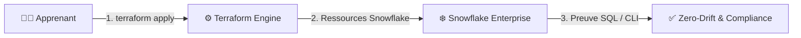

# 🧪 Lab J2 — Team BUSINESS DATA · Manel · Leila · Olfa

| Élément | Valeur |
|---|---|
| **Durée** | 1 h |
| **Prérequis** | Jour 1 terminé — `No changes.` obtenu |
| **Workspace** | `environments/dev/` (le même qu'hier) |
| **Aujourd'hui** | Terraform uniquement — plus de clic Snowsight |

---

## 🚀 4. Pre-Flight Diagnostic

```powershell
terraform version    # 1.14.x
terraform plan       # doit afficher "No changes." (le code d'hier est aligné)
```

✅ **Checkpoint 0 :** `No changes.` — sinon, corrigez avant de continuer.

## 🎯 3. Objectifs Pédagogiques Vérifiables

- ✅ `locals.tf` introduit → `plan` = **`No changes.`** (refactoring réussi)
- ✅ `validation` testée → `plan` **échoue** avec une valeur invalide
- ✅ 3 objets créés via **`for_each`** → `Plan: 3 to add`
- ✅ `terraform output` affiche mon **contrat** (noms des objets)
- ✅ Preuve SQL : `SHOW <OBJECTS> LIKE '<PREFIX>%';` retourne mes 3 objets

---
## 🎯 1. Mission Métier & User Story

> **En tant que** membre de l'équipe Business Data
> **Je veux** passer de 1 table à une **collection** de tables métier
> **Afin de** produire du code industrialisable : factorisé, validé, multiplié, exposé

### Ma collection du jour

| Propriétaire | Mes 3 tables | Dans |
|---|---|---|
| **Manel** | `CUSTOMER` · `SEGMENT` · `CUSTOMER_CONTACT` | `APP06_CUSTOMER_DEV.BUSINESS` |
| **Leila** | `PRODUCT` · `PRODUCT_FAMILY` · `PRODUCT_PRICE` | `APP07_PRODUCT_DEV.BUSINESS` |
| **Olfa** | `CAMPAIGN` · `CAMPAIGN_RESPONSE` · `CAMPAIGN_CHANNEL` | `APP08_CAMPAIGN_DEV.BUSINESS` |

---

## 🏗️ 2. Architecture & Modèle Mental



Dans ce lab, vous industrialisez la création et le contrôle d'objets Snowflake : le code devient la source de vérité et Terraform détecte toute dérive.

---

## 📝 Étape 5.1 — `locals` : arrêter de se répéter

**Problème :** hier, j'ai répété `snowflake_database.ma_db.name` et le commentaire partout. Si je crée 3 tables, je répète 3 fois.

**Solution :** un `local` calcule la valeur **une fois**, et tout le monde la réutilise.

Créez **`locals.tf`** :

```hcl
# Les valeurs calculées UNE SEULE FOIS, réutilisées partout.

locals {
  # Le préfixe complet : "APP06_DEV"
  prefix_env = "${var.learner_prefix}_${var.environment}"

  # Le commentaire standard de toutes mes ressources
  common_comment = "Managed by Terraform | Training | ${var.learner_prefix}"
}
```

Dans **`main.tf`**, remplacez les commentaires en dur :

```hcl
resource "snowflake_database" "ma_db" {
  name    = "${var.learner_prefix}_CUSTOMER_${var.environment}"
  comment = local.common_comment   # ← avant : "Managed by Terraform | ..."
  # ... le reste inchangé
}
```

```powershell
terraform plan
```

```text
No changes.   # ← refactoring réussi
```

> 🧠 **`No changes.` = refactoring réussi.**

> 📷 **[CAPTURE]** Le plan No changes. après l'introduction du local — voir `usecase/screenshots/MANIFEST.md`

---

## 📝 Étape 5.2 — `validation` : bloquer les erreurs avant le plan

**Problème :** une faute de frappe dans `environment` passe au plan et crée un objet au mauvais nom.

**Solution :** le bloc `validation` vérifie la valeur **avant** tout contact avec Snowflake.

Votre `variables.tf` a déjà la validation sur `environment` — **testez le garde-fou** : dans `terraform.tfvars`, mettez `environment = "developement"` → `terraform plan` :

```text
╷ Error: Invalid value for variable
╵ environment must be DEV, UAT or PROD.
```

> 🧠 **L'erreur arrive AVANT.** Remettez `DEV` → `plan` → `No changes.`

> 📷 **[CAPTURE]** L'erreur de validation dans le terminal — voir `usecase/screenshots/MANIFEST.md`

---

## 📝 Étape 5.3 — `for_each` : multiplier sans copier-coller

**Problème :** je dois créer 3 tables. Copier-coller le bloc `resource` 3 fois = 3 blocs à maintenir.

**Solution :** `for_each` boucle sur une **map** — un seul bloc, N objets.

### 3a. Déclarez la collection dans `variables.tf`

```hcl
# La liste de mes tables — une map : clé → objet
variable "tables" {
  type = map(object({
    name    = string   # le nom réel de la table
    comment = string   # la description métier
  }))
  description = "Mes tables métier"
}
```

### 3b. Donnez les valeurs dans `terraform.tfvars`

```hcl
# Manel — ajoutez à la fin du fichier :
tables = {
  customer = { name = "CUSTOMER",         comment = "Référentiel client" }
  segment  = { name = "SEGMENT",          comment = "Segments clients" }
  contact  = { name = "CUSTOMER_CONTACT", comment = "Contacts clients" }
}
```

*(Leila : `product`/`family`/`price` → `PRODUCT`, `PRODUCT_FAMILY`, `PRODUCT_PRICE` · Olfa : `campaign`/`response`/`channel` → `CAMPAIGN`, `CAMPAIGN_RESPONSE`, `CAMPAIGN_CHANNEL`)*

### 3c. Un seul bloc dans `main.tf`

```hcl
# UN bloc → TROIS tables. for_each boucle sur la map.
resource "snowflake_table" "collection" {
  for_each = var.tables          # ← la boucle

  database = snowflake_database.ma_db.name
  schema   = snowflake_schema.mon_schema.name
  name     = each.value.name     # ← le nom vient de la map
  comment  = "${each.value.comment} | ${local.common_comment}"

  column {
    name = "ID"
    type = "NUMBER(38,0)"
  }
  column {
    name = "LABEL"
    type = "VARCHAR(255)"
  }
}
```

```powershell
terraform plan
```

```text
Plan: 3 to add, 0 to change, 0 to destroy.
```

> 🧠 **Pour ajouter une 4ᵉ table demain :** une ligne dans `terraform.tfvars`. Zéro ligne de code.

> 📷 **[CAPTURE]** Snowsight — les 3 tables créées — voir `usecase/screenshots/MANIFEST.md`

---

## 📝 Étape 5.4 — `output` : exposer mon contrat

**Problème :** les autres équipes auront besoin de mes noms de database/schema. Comment les partager ?

**Solution :** `output` publie les valeurs — c'est le **contrat** de mon projet.

Créez **`outputs.tf`** :

```hcl
# Ce que mon projet EXPOSE aux autres.

output "database_name" {
  description = "Ma database métier"
  value       = snowflake_database.ma_db.name
}

output "schema_name" {
  description = "Mon schema"
  value       = snowflake_schema.mon_schema.name
}

output "table_names" {
  description = "Toutes mes tables — clé → nom réel"
  value       = { for k, t in snowflake_table.collection : k => t.name }
}
```

```powershell
terraform apply    # crée les tables
terraform output   # affiche le contrat
```

```text
database_name = "APP06_CUSTOMER_DEV"
schema_name   = "BUSINESS"
table_names = {
  "contact"  = "CUSTOMER_CONTACT"
  "customer" = "CUSTOMER"
  "segment"  = "SEGMENT"
}
```

> 🧠 **`output` = ce que je promets aux autres équipes.**

> 📷 **[CAPTURE]** terraform output dans le terminal — voir `usecase/screenshots/MANIFEST.md`

---

## 🐛 6. Incident Contrôlé (*Chaos Engineering Lab*)

1. Dans `terraform.tfvars`, mettez **deux clés identiques** dans `tables`.
2. `terraform plan` → Terraform refuse : les clés d'une map sont uniques.
3. Corrigez → `No changes.`

> 🧠 **La map garantit l'unicité.**

---

## 🤖 7. Validation Automatisée (*Check My Progress*)

```powershell
..\..\..\student-track\module-XX-environment\validate.ps1
```

*Si le script n'existe pas encore, vérifiez manuellement que `terraform plan` affiche `No changes.`*


## 🏆 8. Défi Autonome (*Unguided Challenge*)

> Ajoutez une 4ᵉ table `CUSTOMER_SCORE` **uniquement** en modifiant `terraform.tfvars`.

**Critères :** `Plan: 1 to add` · `main.tf` non modifié · second plan `No changes.`

---

## 🧹 9. Nettoyage Contrôlé (*FinOps Teardown*)

> 🔴 **Ne faites PAS `terraform destroy`** — vos ressources servent au Jour 3.

---

## 🃏 Anti-sèche

```hcl
# locals.tf — calculé une fois
locals { prefix_env = "${var.learner_prefix}_${var.environment}" }

# variables.tf — la collection
variable "tables" { type = map(object({ name = string, comment = string })) }

# main.tf — un bloc, N objets
resource "snowflake_table" "collection" {
  for_each = var.tables
  database = snowflake_database.ma_db.name
  schema   = snowflake_schema.mon_schema.name
  name     = each.value.name
}

# outputs.tf — le contrat
output "table_names" {
  value = { for k, t in snowflake_table.collection : k => t.name }
}
```

| Fondement | En une phrase |
|---|---|
| `locals` | Calculé une fois, réutilisé partout |
| `validation` | Erreur bloquée **avant** le plan |
| `for_each` | Un bloc + une map = N objets |
| `output` | Ce que je publie aux autres |
