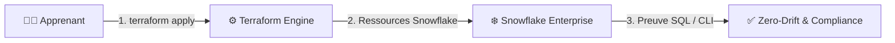

# 🧪 Lab J2 — Team PLATFORM · Mohamed · Sirine

| Élément | Valeur |
|---|---|
| **Durée** | 1 h |
| **Prérequis** | Jour 1 terminé — `No changes.` obtenu |
| **Workspace** | `environments/dev/` (le même qu'hier) |
| **Aujourd'hui** | Terraform uniquement — plus de clic Snowsight |

---

## 🚀 4. Pre-Flight Diagnostic

```powershell
terraform version    # 1.14.x
terraform plan       # doit afficher "No changes." (le code d'hier est aligné)
```

✅ **Checkpoint 0 :** `No changes.` — sinon, corrigez avant de continuer.

## 🎯 3. Objectifs Pédagogiques Vérifiables

- ✅ `locals.tf` introduit → `plan` = **`No changes.`** (refactoring réussi)
- ✅ `validation` testée → `plan` **échoue** avec une valeur invalide
- ✅ 3 objets créés via **`for_each`** → `Plan: 3 to add`
- ✅ `terraform output` affiche mon **contrat** (noms des objets)
- ✅ Preuve SQL : `SHOW <OBJECTS> LIKE '<PREFIX>%';` retourne mes 3 objets

---
## 🎯 1. Mission Métier & User Story

> **En tant que** membre de l'équipe Platform
> **Je veux** passer de 1 warehouse à une **collection** de rôles et warehouses
> **Afin de** produire du code industrialisable : factorisé, validé, multiplié, exposé

### Ma collection du jour

| Propriétaire | Mes 3 objets | Type |
|---|---|---|
| **Mohamed** | `APP02_ENGINEER_DEV` · `APP02_BUSINESS_DEV` · `APP02_ANALYST_DEV` | rôles |
| **Sirine** | `WH_APP03_FINANCE_DEV` · `WH_APP03_QUALITY_DEV` · `WH_APP03_LOAD_DEV` | warehouses |

---

## 🏗️ 2. Architecture & Modèle Mental



Dans ce lab, vous industrialisez la création et le contrôle d'objets Snowflake : le code devient la source de vérité et Terraform détecte toute dérive.

---

## 📝 Étape 5.1 — `locals` : arrêter de se répéter

**Problème :** hier, j'ai écrit `"WH_${var.learner_prefix}_INGEST_${var.environment}"`. Si je crée 3 warehouses, je répète ce bout de chaîne 3 fois. Une faute de frappe quelque part → incohérence.

**Solution :** un `local` calcule la valeur **une fois**, et tout le monde la réutilise.

Créez **`locals.tf`** :

```hcl
# Les valeurs calculées UNE SEULE FOIS, réutilisées partout.
# local.xxx se lit comme var.xxx, mais ce n'est pas une entrée — c'est un calcul interne.

locals {
  # Le préfixe complet : "APP01_DEV" (utilisé pour les commentaires, pas les noms)
  prefix_env = "${var.learner_prefix}_${var.environment}"

  # Le commentaire standard de toutes mes ressources
  common_comment = "Managed by Terraform | Training | ${var.learner_prefix}"
}
```

Dans **`main.tf`**, remplacez le nom en dur par le local :

```hcl
resource "snowflake_warehouse" "mon_wh" {
  name = "WH_${var.learner_prefix}_INGEST_${var.environment}"   # ← avant : "${var.learner_prefix}_..._${var.environment}"
  #    = WH_APP01_INGEST_DEV
  #    ... le reste inchangé
}
```

```powershell
terraform plan
```

```text
No changes.   # ← le nom calculé est identique, juste mieux écrit
```

> 🧠 **`No changes.` = refactoring réussi.** Vous avez changé *comment* le nom est écrit, pas *ce qu'il vaut*.


---

## 📝 Étape 5.2 — `validation` : bloquer les erreurs avant le plan

**Problème :** hier, quelqu'un a tapé `environment = "developement"` dans son tfvars. Le plan est passé — et a créé `APP01_DEVELOPEMENT_…`. L'erreur n'a été vue qu'après l'apply.

**Solution :** le bloc `validation` vérifie la valeur **avant** que Terraform ne touche quoi que ce soit.

Dans **`variables.tf`**, votre variable `environment` a déjà une validation — relisez-la :

```hcl
variable "environment" {
  type    = string
  default = "DEV"

  validation {                                            # ← le garde-fou
    condition     = contains(["DEV", "UAT", "PROD"], var.environment)
    error_message = "environment must be DEV, UAT or PROD."
  }
}
```

**Testez le garde-fou :** dans `terraform.tfvars`, mettez `environment = "developement"` → `terraform plan` :

```text
╷ Error: Invalid value for variable
╵ environment must be DEV, UAT or PROD.
```

> 🧠 **L'erreur arrive AVANT tout contact avec Snowflake.** Remettez `DEV` → `plan` → `No changes.`


---

## 📝 Étape 5.3 — `for_each` : multiplier sans copier-coller

**Problème :** je dois créer 3 rôles. Copier-coller le bloc `resource` 3 fois = 3 blocs à maintenir. Une correction → 3 endroits à modifier.

**Solution :** `for_each` boucle sur une **map** — un seul bloc, N objets.

### 3a. Déclarez la collection dans `variables.tf`

```hcl
# La liste de mes rôles — une map : clé → objet
variable "roles" {
  type = map(object({
    suffix  = string   # la fin du nom
    comment = string   # la description métier
  }))
  description = "Mes rôles d'accès"
}
```

### 3b. Donnez les valeurs dans `terraform.tfvars`

```hcl
# Mohamed — ajoutez à la fin du fichier :
roles = {
  engineer = { suffix = "ENGINEER", comment = "Ingénierie data" }
  business = { suffix = "BUSINESS", comment = "Accès métier" }
  analyst  = { suffix = "ANALYST",  comment = "Analyse BI" }
}
```

*(Sirine : adaptez avec une variable `warehouses` et `snowflake_warehouse`)*

### 3c. Un seul bloc dans `main.tf`

```hcl
# UN bloc → TROIS rôles. for_each boucle sur la map.
resource "snowflake_account_role" "access" {
  for_each = var.roles          # ← la boucle

  # each.key   = "raw_reader"     (la clé de la map)
  # each.value = { suffix = "RAW_READER", comment = "..." }
  name    = "${var.learner_prefix}_${each.value.suffix}_${var.environment}"
  #        = APP01_RAW_READER_DEV
  comment = "${each.value.comment} | ${local.common_comment}"
}
```

```powershell
terraform plan
```

```text
Plan: 3 to add, 0 to change, 0 to destroy.
```

> 🧠 **Pour ajouter un 4ᵉ rôle demain :** une ligne dans `terraform.tfvars`. Zéro ligne de code.


---

## 📝 Étape 5.4 — `output` : exposer mon contrat

**Problème :** les autres équipes auront besoin de mes noms de rôles pour les grants. Comment les partager sans envoyer un mail ?

**Solution :** `output` publie les valeurs — c'est le **contrat** de mon projet.

Créez **`outputs.tf`** :

```hcl
# Ce que mon projet EXPOSE aux autres.
# terraform output les affiche ; un autre projet pourra les lire.

output "warehouse_name" {
  description = "Mon warehouse du Jour 1"
  value       = snowflake_warehouse.mon_wh.name
}

output "role_names" {
  description = "Tous mes rôles — clé → nom réel"
  value       = { for k, r in snowflake_account_role.access : k => r.name }
}
```

```powershell
terraform apply    # crée les rôles
terraform output   # affiche le contrat
```

```text
role_names = {
  "core_reader" = "APP01_CORE_READER_DEV"
  "mart_reader" = "APP01_MART_READER_DEV"
  "raw_reader"  = "APP01_RAW_READER_DEV"
}
warehouse_name = "WH_APP01_INGEST_DEV"
```

> 🧠 **`output` = ce que je promets aux autres équipes.** Demain, on lira les outputs des autres pour se connecter.


---

## 🐛 6. Incident Contrôlé (*Chaos Engineering Lab*)

1. Dans `terraform.tfvars`, mettez **deux clés identiques** dans `roles` (ex: deux fois `raw_reader`).
2. `terraform plan` → Terraform refuse : les clés d'une map sont uniques.
3. Corrigez → `No changes.`

> 🧠 **La map garantit l'unicité.** Impossible de créer deux fois le même objet.

---

## 🤖 7. Validation Automatisée (*Check My Progress*)

```powershell
..\..\..\student-track\module-XX-environment\validate.ps1
```

*Si le script n'existe pas encore, vérifiez manuellement que `terraform plan` affiche `No changes.`*


## 🏆 8. Défi Autonome (*Unguided Challenge*)

> Ajoutez un 4ᵉ rôle `compliance_reader` (`APP01_COMPLIANCE_READER_DEV`) **uniquement** en modifiant `terraform.tfvars`.

**Critères :** `Plan: 1 to add` · `main.tf` non modifié · second plan `No changes.`

---

## 🧹 9. Nettoyage Contrôlé (*FinOps Teardown*)

> 🔴 **Ne faites PAS `terraform destroy`** — vos ressources servent au Jour 3.

---

## 🃏 Anti-sèche

```hcl
# locals.tf — calculé une fois
locals { prefix_env = "${var.learner_prefix}_${var.environment}" }

# variables.tf — la collection
variable "roles" { type = map(object({ suffix = string, comment = string })) }

# main.tf — un bloc, N objets
resource "snowflake_account_role" "access" {
  for_each = var.roles
  name     = "${var.learner_prefix}_${each.value.suffix}_${var.environment}"
}

# outputs.tf — le contrat
output "role_names" {
  value = { for k, r in snowflake_account_role.access : k => r.name }
}
```

| Fondement | En une phrase |
|---|---|
| `locals` | Calculé une fois, réutilisé partout |
| `validation` | Erreur bloquée **avant** le plan |
| `for_each` | Un bloc + une map = N objets |
| `output` | Ce que je publie aux autres |
