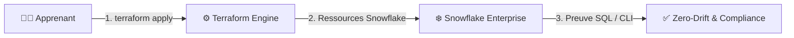

# 🧪 Lab J3 — Team BI / ANALYTICS · Ghassen · Adem · Hadhemi

| Élément | Valeur |
|---|---|
| **Durée** | 1 h |
| **Prérequis** | Jour 2 terminé — `No changes.` obtenu |
| **Workspace** | `environments/dev/` (le même) |
| **Aujourd'hui** | Terraform uniquement |

---

## 🚀 4. Pre-Flight Diagnostic

```powershell
terraform version    # 1.14.x
terraform plan       # doit afficher "No changes." (le code d'hier est aligné)
```

✅ **Checkpoint 0 :** `No changes.` — sinon, corrigez avant de continuer.

## 🎯 3. Objectifs Pédagogiques Vérifiables

- ✅ `moved` → le plan affiche **`has moved to`**, 0 destroy
- ✅ `import` → `terraform state list` montre l'objet **legacy**
- ✅ `module` → `terraform init` puis `apply` via le module
- ✅ `data` source → `terraform output` affiche l'objet **lu** (non géré)
- ✅ Preuve SQL : `SHOW <OBJECTS> LIKE '<PREFIX>%';` retourne mes objets

---
## 🎯 1. Mission Métier & User Story

> **En tant que** membre de l'équipe BI / Analytics
> **Je veux** corriger, adopter et factoriser mon code en **module réutilisable**
> **Afin de** transformer ma collection en brique de plateforme

### Ma ressource de travail

| Propriétaire | Ma collection (J2) | Mon objet legacy (J1, créé à la main) |
|---|---|---|
| **Ghassen** | `mart_tables` → 3 tables dans `APP09_CUSTOMER_MART_DEV.MART` | `APP09_LEGACY` (database) |
| **Adem** | `mart_tables` → 3 tables dans `APP10_FINANCE_MART_DEV.MART` | `APP10_LEGACY` (database) |
| **Hadhemi** | `mart_tables` → 3 tables dans `APP11_TRANSACTION_MART_DEV.MART` | `APP11_LEGACY` (database) |

---

## 🏗️ 2. Architecture & Modèle Mental



Dans ce lab, vous industrialisez la création et le contrôle d'objets Snowflake : le code devient la source de vérité et Terraform détecte toute dérive.

---

## 📝 Étape 5.1 — `moved` : renommer sans détruire

**Problème :** je veux renommer mon bloc `snowflake_table.collection` en `snowflake_table.mart`. Si je change juste le nom du bloc, Terraform voit : *« détruire `collection`, créer `mart` »* → les tables sont détruites puis recréées. Sur des tables avec des données, c'est un incident.

**Solution :** le bloc `moved` dit à Terraform *« c'est le même objet, juste une nouvelle adresse »*.

Dans **`main.tf`**, renommez le bloc ET ajoutez le `moved` :

```hcl
# AVANT : resource "snowflake_table" "collection"
# APRÈS : le bloc s'appelle "mart"
resource "snowflake_table" "mart" {
  for_each = var.mart_tables
  database = snowflake_database.mon_mart.name
  schema   = snowflake_schema.mon_schema.name
  name     = each.value.name
  comment  = "${each.value.comment} | ${local.common_comment}"
  # ... colonnes inchangées
}

# Je dis à Terraform : "collection" et "mart" sont LE MÊME objet
moved {
  from = snowflake_table.collection
  to   = snowflake_table.mart
}
```

```powershell
terraform plan
```

```text
  # snowflake_table.collection["customer_360"] has moved to
  # snowflake_table.mart["customer_360"]

Plan: 0 to add, 0 to change, 0 to destroy.
```

> 🧠 **`moved` met à jour la mémoire de Terraform sans toucher Snowflake.** Les données sont préservées.

> 📷 **[CAPTURE]** Le plan has moved to — 0 destroy — voir `usecase/screenshots/MANIFEST.md`

---

## 📝 Étape 5.2 — `import` : adopter un objet existant

**Problème :** au Jour 1, j'ai créé `APP09_LEGACY` **à la main** dans Snowsight. Il existe dans Snowflake mais pas dans mon code. C'est une **ressource orpheline**.

**Solution :** `import` ajoute l'objet existant dans la mémoire de Terraform, **sans le recréer**.

### 2a. Déclarez le bloc dans `main.tf`

```hcl
# L'objet legacy — je déclare ce qui existe déjà dans Snowflake
resource "snowflake_database" "legacy" {
  name    = "${var.learner_prefix}_LEGACY"
  comment = "Database legacy — adoptée par import"
}
```

### 2b. Importez l'objet réel

```powershell
terraform import snowflake_database.legacy APP09_LEGACY
```

```text
Import successful!
snowflake_database.legacy: Import prepared!
snowflake_database.legacy: Refreshing state...
```

```powershell
terraform plan
```

```text
No changes.   # ← le code correspond à l'objet réel
```

> 🧠 **`import` = adoption.** L'objet était orphelin, il est maintenant sous gestion Terraform.

> 📷 **[CAPTURE]** terraform state list montrant legacy — voir `usecase/screenshots/MANIFEST.md`

---

## 📝 Étape 5.3 — `module` : factoriser ma collection

**Problème :** les onze apprenants ont écrit **la même structure** — un `for_each` sur une map de tables. Pourquoi l'écrire onze fois ?

**Solution :** un **module** = le code écrit une fois, appelé N fois. **Votre code du Jour 2 devient le module — sans le réécrire.**

### 3a. Créez le dossier du module

```
environments/dev/
└── modules/
    └── tables/
        ├── main.tf        → les resources (votre code du J2)
        ├── variables.tf   → les entrées du module
        └── outputs.tf     → les sorties du module
```

### 3b. `modules/tables/variables.tf` — les entrées

```hcl
# Ce que l'appelant doit fournir au module
variable "tables" {
  type = map(object({
    name    = string
    comment = string
  }))
}

variable "database" {
  type = string   # la database cible
}

variable "schema" {
  type = string   # le schema cible
}

variable "common_comment" {
  type = string
}
```

### 3c. `modules/tables/main.tf` — votre code du J2, tel quel

```hcl
# Le même for_each qu'hier — mais les valeurs viennent du module
resource "snowflake_table" "this" {
  for_each = var.tables
  database = var.database
  schema   = var.schema
  name     = each.value.name
  comment  = "${each.value.comment} | ${var.common_comment}"

  column {
    name = "ID"
    type = "NUMBER(38,0)"
  }
  column {
    name = "METRIC"
    type = "VARCHAR(255)"
  }
}
```

### 3d. `modules/tables/outputs.tf` — les sorties

```hcl
output "table_names" {
  value = { for k, t in snowflake_table.this : k => t.name }
}
```

### 3e. Dans `main.tf` racine — remplacez le bloc `resource` par l'appel

```hcl
# Je ne crée plus les tables moi-même — j'APPELLE le module
module "mes_tables" {
  source = "./modules/tables"   # ← où est le module

  tables         = var.mart_tables                     # entrée : ma collection
  database       = snowflake_database.mon_mart.name    # entrée : mon mart
  schema         = snowflake_schema.mon_schema.name    # entrée : mon schema
  common_comment = local.common_comment                # entrée : mon commentaire
}
```

```powershell
terraform init    # ← OBLIGATOIRE : Terraform découvre le module
terraform plan
```

```text
  # module.mes_tables.snowflake_table.this["customer_360"] will be created
  # snowflake_table.mart["customer_360"] will be destroyed
```

> ⚠️ **Le module change l'adresse** → ajoutez un `moved` par clé, ou laissez recréer (des tables vides, pas de données).

```powershell
terraform apply
```

> 🧠 **Un module = une fonction.** Entrées (`variables`), traitement (`main.tf`), sorties (`outputs`). Écrit une fois, appelé N fois.

> 📷 **[CAPTURE]** L'arborescence modules/ dans VS Code — voir `usecase/screenshots/MANIFEST.md`

---

## 📝 Étape 5.4 — `data` source : lire ce que je n'ai pas créé

**Problème :** BI doit connaître la database métier de Business Data pour préparer les vues. Mais je ne l'ai pas créée — je ne peux pas la mettre dans un `resource`.

**Solution :** `data` source = **lire** une ressource existante sans la gérer.

Dans **`main.tf`**, ajoutez :

```hcl
# Je LIS la database de Manel — je ne la crée pas, je ne la gère pas
data "snowflake_database" "customer" {
  name = "APP06_CUSTOMER_DEV"   # la database de l'équipe Business Data
}
```

Et dans **`outputs.tf`** :

```hcl
output "database_lue" {
  description = "La database Business Data que j'ai lue (sans la gérer)"
  value       = data.snowflake_database.customer.name
}
```

```powershell
terraform plan    # → No changes (une data source ne crée rien)
terraform apply
terraform output database_lue
```

```text
"APP06_CUSTOMER_DEV"
```

> 🧠 **`resource` = je crée et je gère. `data` = je lis seulement.** C'est le `SELECT` de Terraform.

> 📷 **[CAPTURE]** terraform output montrant la database lue — voir `usecase/screenshots/MANIFEST.md`

---

## 🐛 6. Incident Contrôlé (*Chaos Engineering Lab*)

1. Dans `modules/tables/variables.tf`, changez le type de `tables` en `string` (au lieu de `map(object(...))`).
2. `terraform plan` → erreur : l'appelant envoie une map, le module attend une string.
3. Corrigez → `No changes.`

> 🧠 **Les variables du module sont son contrat.** Les casser casse tous les appelants.

---

## 🤖 7. Validation Automatisée (*Check My Progress*)

```powershell
..\..\..\student-track\module-XX-environment\validate.ps1
```

*Si le script n'existe pas encore, vérifiez manuellement que `terraform plan` affiche `No changes.`*


## 🏆 8. Défi Autonome (*Unguided Challenge*)

> Ajoutez une table `NPS_SCORE` via `terraform.tfvars` — **sans toucher au module ni à `main.tf`**.

**Critères :** `Plan: 1 to add` · `modules/` non modifié · second plan `No changes.`

---

## 🧹 9. Nettoyage Contrôlé (*FinOps Teardown*)

> 🔴 **Ne faites PAS `terraform destroy`.**

---

## 🃏 Anti-sèche

```hcl
# moved — renommer sans détruire
moved {
  from = snowflake_table.collection
  to   = snowflake_table.mart
}

# import — adopter un objet existant
# terraform import snowflake_database.legacy APP09_LEGACY

# module — appeler du code factorisé
module "mes_tables" {
  source   = "./modules/tables"
  tables   = var.mart_tables
  database = snowflake_database.mon_mart.name
  schema   = snowflake_schema.mon_schema.name
}

# data — lire sans gérer
data "snowflake_database" "customer" {
  name = "APP06_CUSTOMER_DEV"
}
```

| Fondement | En une phrase |
|---|---|
| `moved` | Renomme dans le state, sans détruire |
| `import` | Adopte un objet existant |
| `module` | Code écrit une fois, appelé N fois |
| `data` | Lit ce que je n'ai pas créé |
