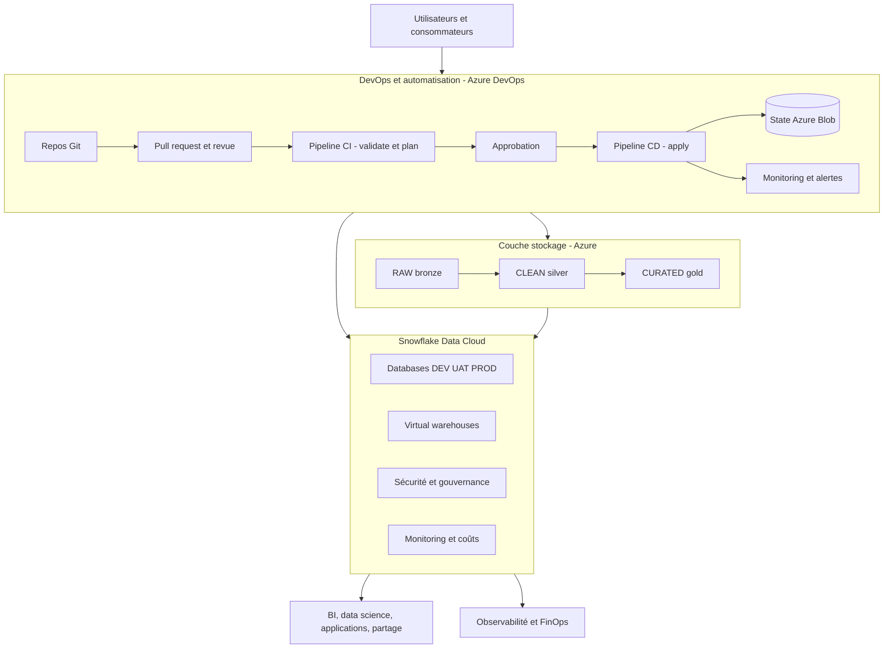

# Architecture cible

Ce document décrit l'architecture que le projet construit progressivement au fil du parcours de formation.

## Vue d'ensemble



## Composants

| Couche | Technologie | Rôle |
|---|---|---|
| Data Cloud | Snowflake Enterprise | Entreposage et calcul |
| Isolation | Nommage DEV, UAT, PROD | Séparation des environnements |
| Infrastructure as Code | Terraform | Provisionnement reproductible |
| État distant | Azure Blob Storage | State verrouillé et chiffré |
| Secrets | Azure Key Vault | Clés privées et jetons |
| CI/CD | Azure DevOps | Validation, plan, approbation, apply, audit |
| Stockage | Azure Data Lake Storage Gen2 | Bronze, Silver, Gold |
| Transformation | dbt | Modèles et FinOps |

## Environnements

| Environnement | Objectif | Caractéristiques |
|---|---|---|
| `DEV` | Développement itératif | Coûts limités, données non sensibles |
| `UAT` | Validation pré-production | Tests d'acceptation |
| `PROD` | Production | Haute disponibilité, sécurité renforcée |

## Isolation

Toutes les ressources suivent la convention :

```text
<PREFIXE_APPRENANT>_<ZONE>_<ENVIRONNEMENT>
```

Le préfixe apprenant évite les collisions entre participants. Le suffixe d'environnement reproduit l'isolation de production.

## Sécurité

- aucun secret dans le dépôt;
- authentification par PAT temporaire en formation, puis JWT key-pair avec Key Vault;
- RBAC au moindre privilège;
- state chiffré et verrouillé dans Azure Blob Storage;
- pipeline sans secret client en clair (fédération d'identité).

## Correspondance avec la formation

| Jour | Bloc construit | Modules officiels mobilisés |
|---|---|---|
| Jour 1 | Premier projet Terraform et objets Snowflake de base | M01 — IaC Workflow |
| Jour 2 | Variables, `locals`, `validation`, `for_each`, `outputs` | M04 — Variables & Outputs, M06 — Logique dynamique |
| Jour 3 | `moved`, `import`, modules, `data` sources | M03 — Import Brownfield, M05 — Modules réutilisables |
| Jour 4 | Backend Azure Blob, modules, environnements DEV/UAT/PROD | M02 — State Management, M05 — Modules, M08 — Environnements |
| Jour 5 | Pipeline Azure DevOps, sécurité, RBAC, FinOps, Data Products et capstone | M07 — CI/CD, M10 — Security, M11 — RBAC, M13 — FinOps, M14 — Data Products, M12 — Capstone |
